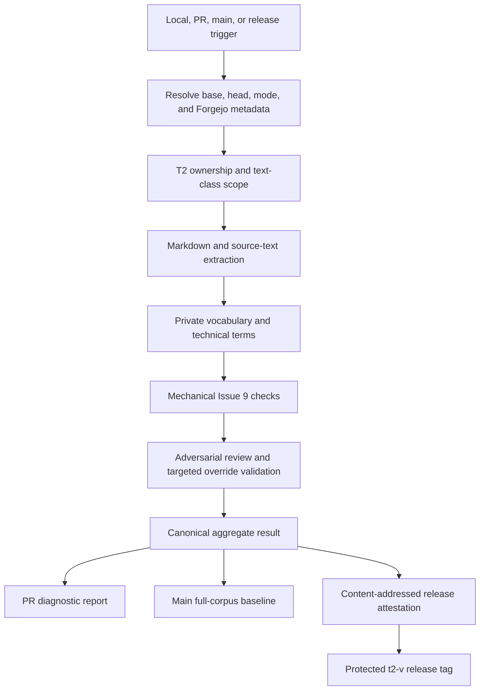
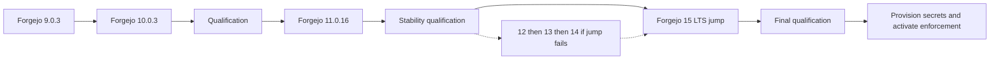

# ASD-STE100 Enforcement - Plan

## Goal Capsule

- **Objective:** Define one fail-closed Forgejo suite that applies ASD-STE100 Issue 9 to the T2 enforcement patch.
- **Product authority:** T2 owns its enforcement patch and typed system information. Upstream T3 keeps authority over T3 features and maintenance.
- **Open blockers:** Live Forgejo is 15.0.6 with runner 13.0.0. Host upgrade units U8 and U9 are complete. Enforcement secrets stay unprovisioned until remaining 15 live proofs pass. Planning can use test vocabulary until the private official vocabulary is available on the runner.

---

## Product Contract

### Summary

T2 will enforce ASD-STE100 rules at its patch boundary.
The enforcement will not change upstream T3 or raw conversation text.
Forgejo will control merge and release promotion through one rule-enforcement suite.

### Problem Frame

T2 must preserve human intent when it changes raw requests into system language.
Uncontrolled language can introduce semantic differences before a system performs work.
T2 also needs to stay close to upstream T3 without taking authority over upstream content.

### Key Decisions

- **Patch authority only:** The suite checks T2-owned text and excludes unchanged upstream T3 text.
- **Dual scope proof:** Upstream ancestry and an ownership manifest must both identify T2-owned content.
- **Two raw text classes:** Raw prompts and the human-agent conversation chain remain unchanged.
- **All other typed information is governed:** T2 must translate non-conversational text into compliant system language.
- **Repair before override:** A failed translation enters repair, then blocks. A targeted override is the last path.
- **Adversarial parity:** Human and agent reviewers use the same reviewer class. The reviewer identity must differ from the author identity.
- **Simple promotion chain:** Changes move from PR to `main`, then to a release tag. T2 has no `dev` branch.
- **Forgejo authority:** Forgejo owns CI and CD. GitHub remains the upstream and collaboration surface.

### Actors

- A1. **Author:** A human or agent that creates T2-owned text or code.
- A2. **Compliance reviewer:** A named human or agent with Forgejo review authority.
- A3. **Forgejo runner:** The system that runs the rule-enforcement suite and stores private vocabulary access.
- A4. **Release operator:** A human or agent that requests release promotion.
- A5. **Upstream T3 maintainer:** An external actor whose unchanged content remains outside T2 authority.

### Requirements

**Authority and scope**

- R1. The suite must use `upstream/main` as the base authority for unchanged T3 content.
- R2. The suite must combine upstream ancestry with an explicit ownership manifest.
- R3. The suite must exclude unchanged upstream files, generated files, vendored files, identifiers, and protocol field names.
- R4. The suite must exclude raw prompts and the complete human-agent conversation chain.
- R5. The suite must govern every other T2-authored typed item.
- R6. The suite must classify external logs and provider errors as non-conversational evidence before it publishes them.
- R7. This work must not create a communication service, authority node, or comms-manifold contract.

**ASD-STE100 profile**

- R8. The suite must identify ASD-STE100 Issue 9 as its normative language reference.
- R9. The suite must not claim ASD approval, ASD certification, or complete automated compliance.
- R10. The suite must use a private official vocabulary file on the Forgejo runner.
- R11. The suite must pin and verify the expected vocabulary checksum.
- R12. The suite must fail when the vocabulary file or expected checksum is unavailable.
- R13. House-style rules must stay disabled or use a non-ASD namespace outside the aggregate gate.
- R14. The suite must give each finding an ASD rule ID and an exact source location.

**Intent preservation**

- R15. T2 must retain the raw prompt and the raw conversation as origin evidence.
- R16. When an intent artifact exists, the suite must require a human-approved normalized intent record.
- R17. When intent checks apply, the suite must trace origin, normalized intent, system text, rule results, and review decisions.
- R18. This plan defines trace requirements but does not define the intent contract.

**Failure and override**

- R19. T2-owned non-conversational repository text must fail CI until it passes the applicable checks.
- R20. A targeted override request must include evidence of bounded repair attempts.
- R21. The suite must fail closed when repair evidence is absent, invalid, or unresolved.
- R22. A targeted override must be available only after repair fails.
- R23. A structured Forgejo approval review must carry each targeted override.
- R24. Each override must name the file, stable occurrence anchor, ASD rule ID, content hash, repair-attempt hashes, reason, and reviewer identity.
- R25. A content change must invalidate its targeted override.
- R26. The author and override reviewer must have different Forgejo identities.
- R27. Human and agent accounts must use the same review evidence and authority checks.
- R28. The suite must not accept shared reviewer credentials or silent source suppressions.

**CI and CD**

- R29. `npm run ci:asd-ste100` must be the single local and Forgejo entry point.
- R30. PR runs must check the T2 delta against the pinned upstream base.
- R31. Main-branch runs must check the complete T2-owned corpus and exclude only registered suite fixtures.
- R32. PR checks must include patch files, PR title and body, and fork-authored commit messages.
- R33. The suite must exclude imported upstream commits and generated merge commits.
- R34. Any required gate failure must block merge.
- R35. A release tag must require a current full-corpus result and a mechanical rule-subset attestation.
- R36. The rule-subset attestation must identify the upstream SHA, ownership checksum, corpus checksum, vocabulary checksum, review identities, findings, and targeted overrides.
- R37. Forgejo must block release promotion when the attestation is absent or invalid.

### CI Test Definitions

| ID  | Test                  | Input                                         | Pass condition                                           | Failure evidence                                                 |
| --- | --------------------- | --------------------------------------------- | -------------------------------------------------------- | ---------------------------------------------------------------- |
| T1  | Scope test            | Upstream refs, patch refs, ownership manifest | Only T2-owned content enters the governed set            | Unexpected inclusion or exclusion with path and ownership reason |
| T2  | Extraction test       | Patch prose fixtures and raw-text fixtures    | Authored prose is extracted and raw text stays unchanged | File, line, text class, and extraction difference                |
| T3  | Mechanical rules test | Passing and failing Issue 9 fixtures          | Each supported mechanical rule gives the expected result | Rule ID, location, count, and repair guidance                    |
| T4  | Vocabulary test       | Private vocabulary, checksum, technical terms | Vocabulary is authentic, current, and usable             | Missing path, checksum difference, or rejected term              |
| T5  | Translation test      | Raw origin and generated system text          | Raw origin stays unchanged and system text passes        | Origin hash, generated-text hash, and rule findings              |
| T6  | Repair test           | Noncompliant generated text                   | Repair passes within its bounded attempts or blocks      | Attempt count and final rule findings                            |
| T7  | Trace test            | Origin, intent, generated text, and reviews   | All required trace links resolve to matching hashes      | Missing link or hash difference                                  |
| T8  | Review test           | Author and reviewer Forgejo identities        | Reviewer is authorized and differs from author           | Identity and authorization failure                               |
| T9  | Override test         | Failed repair and structured approval review  | Override matches the current PR head and content hash    | Missing field, stale hash, wrong reviewer, or reused approval    |
| T10 | Claim test            | T2-authored prose                             | No prohibited ASD approval or certification claim exists | Exact prohibited claim and location                              |

### CI Gate Definitions

| ID  | Gate                    | Runs                        | Blocks when                                               |
| --- | ----------------------- | --------------------------- | --------------------------------------------------------- |
| G1  | Boundary gate           | PR, `main`, release         | Upstream base, ancestry, or ownership manifest is invalid |
| G2  | Delta gate              | PR                          | Any T2-owned changed text has unresolved rule findings    |
| G3  | Vocabulary gate         | PR, `main`, release         | Private vocabulary or checksum validation fails           |
| G4  | Intent gate             | PR when applicable, release | Required origin-to-system trace evidence is incomplete    |
| G5  | Adversarial review gate | PR, release                 | Reviewer is absent, unauthorized, or equal to author      |
| G6  | Override gate           | PR, `main`, release         | An override is broad, stale, incomplete, or reused        |
| G7  | Aggregate gate          | All CI entry points         | Any required test or gate does not pass                   |

### CD Element Definitions

| ID  | Element                 | Requirement                                                                        |
| --- | ----------------------- | ---------------------------------------------------------------------------------- |
| D1  | Main baseline           | Scan the full T2-owned corpus and publish stable result hashes                     |
| D2  | Release eligibility     | Require current main baseline, valid review evidence, and zero unresolved findings |
| D3  | Rule-subset attestation | Produce one immutable record for the exact release candidate                       |
| D4  | Tag promotion           | Create or publish a release tag only when D2 and D3 pass                           |

### Diagnostic Contract

Diagnostics must follow a direct formatter or linter style.
Each result must identify the file, line, column, rule, problem, and repair.

```text
path:line:column ASD-STE100-5.1 sentence has 24 words. Maximum is 20.
```

### Key Flows

- F1. **PR validation**
  - **Trigger:** An author opens or updates a Forgejo PR.
  - **Actors:** A1, A2, A3.
  - **Steps:** The runner resolves ownership, checks vocabulary and the delta, validates applicable intent and overrides, checks review identity, and reports exact findings.
  - **Outcome:** Forgejo permits merge only when all required gates pass.
  - **Covered by:** R1-R34, with R15-R21 applicable only when intent or repair evidence exists.

- F2. **Repair evidence validation**
  - **Trigger:** An author requests a targeted override after repair attempts fail.
  - **Actors:** A1, A2, A3.
  - **Steps:** The suite validates origin hashes, repair-attempt hashes, final findings, and adversarial review evidence.
  - **Outcome:** The exact finding stays blocked or receives one source-bound override.
  - **Covered by:** R15-R28.

- F3. **Release promotion**
  - **Trigger:** A release operator requests a release tag.
  - **Actors:** A2, A3, A4.
  - **Steps:** Forgejo checks the full corpus, validates trace and review evidence, and creates an attestation.
  - **Outcome:** Forgejo permits the release tag only for the attested candidate.
  - **Covered by:** R31, R35-R37.

### Acceptance Examples

- AE1. **Covers R1-R5.** An upstream T3 documentation sentence violates the T2 profile. The sentence stays excluded when T2 did not change it.
- AE2. **Covers R2, R5.** T2 adds an operator warning inside an upstream source file. The ownership delta includes and checks that warning.
- AE3. **Covers R4, R15.** A user prompt contains non-STE language. T2 stores it without modification and does not report a finding.
- AE4. **Covers R19-R22.** T2-owned text fails a sentence-length rule. Its repair evidence fails, so the finding stays blocked.
- AE5. **Covers R23-R28.** A different authorized agent account approves one exact override. A later text change invalidates that approval.
- AE6. **Covers R30-R34.** An imported upstream commit contains non-STE prose. The PR gate excludes the imported commit.
- AE7. **Covers R35-R37.** A release candidate has no current attestation. Forgejo refuses tag promotion.

### Success Criteria

- One command produces the same result when local and Forgejo runs receive the same prerequisites.
- No upstream-only change creates a T2 rule-subset finding.
- Every T2-owned finding includes an exact location and rule ID.
- No unresolved finding can merge or release.
- No author can approve their own targeted override.
- Every release tag has one valid attestation for its exact source state.

### Scope Boundaries

**Included**

- ASD enforcement for the T2 patch.
- Forgejo PR, main, and release gates.
- T2-authored typed information.
- Equal human-agent reviewer authority.
- Targeted override after failed repair.

**Excluded**

- Changes to upstream T3 prose or maintenance policy.
- Communication-manifold architecture.
- New ASD services, components, or authority nodes.
- Hosted-model routing through OpenRouter.
- OpenCode integration through T3 infrastructure.
- The detailed normalized intent contract.
- Production intent capture, translation, repair, and runtime admission hooks.
- Porting or replacing upstream T3 GitHub workflows. A separate compatibility plan owns T3-wide checks on Forgejo.
- Automated claims of full ASD compliance or certification.

### Dependencies and Assumptions

- The Forgejo runner will receive a private Issue 9 vocabulary file.
- Repository settings can require the aggregate gate before merge and release.
- Each human and agent reviewer will use a distinct Forgejo account.
- The official ASD-STE100 Issue 9 standard remains the normative reference.
- Automated checks aid technical writing but do not replace informed review.

### Sources and Research

- [ASD-STE100 Issue 9](https://www.asd-ste100.org/assets/files/ASD-STE100_ISSUE9.pdf)
- [ASD-STE100 official FAQ](https://www.asd-ste100.org/STE_faq.html)
- [ASD-STE100 tool guidance](https://asd-ste100.org/STEsoftware.html)
- [Agent-native application guide](https://every.to/guides/agent-native)
- `AGENTS.md`
- `docs/internals/ci.md`
- `.github/workflows/ci.yml`

---

## Planning Contract

Product Contract changed: T9 binds overrides to source state.
R6, R13, R16-R21, R31, R36, and F2 now match the confirmed CI-only scope.

### Key Technical Decisions

- **KTD1. Keep enforcement tooling outside product authorities.** Implement the suite under `scripts/asd-ste100/` and `.forgejo/workflows/`. Do not add a service, provider, runtime node, or T3 orchestration concept.
- **KTD2. Use one portable command.** Keep `npm run ci:asd-ste100` as the public entry point. It invokes `node scripts/asd-ste100/cli.ts`, so local and Forgejo runs execute the same logic.
- **KTD3. Use repository-owned deterministic checks.** Implement the mechanical Issue 9 subset in TypeScript. Do not make model calls or depend on an external language-checking service during CI.
- **KTD4. Separate extraction from language rules.** First identify T2-owned prose and its text class. Then run vocabulary and language checks on the extracted records.
- **KTD5. Deny unclassified T2 text.** The ownership manifest starts empty and closed. New T2 text must match an owned text class, a raw conversation class, or a justified machine-literal exclusion.
- **KTD6. Parse source text structurally.** Use the TypeScript compiler API for TypeScript, JavaScript, JSX, and TSX. Use `@lezer/markdown` for prose while excluding code spans, code blocks, and frontmatter.
- **KTD7. Keep official vocabulary private.** Commit only Issue metadata and a SHA-256 checksum. Load the official vocabulary through a runner path and fail before language checks if validation fails.
- **KTD8. Keep technical terms separate.** Commit only T2 technical nouns and verbs with review metadata. Do not copy official ASD definitions, examples, or dictionary content.
- **KTD9. Repair happens before CI.** CI reports deterministic failures and never rewrites source or calls a model. This plan validates repair records with fixtures and does not implement runtime repair.
- **KTD10. Bind reviews to immutable source state.** Validate Forgejo review author ID, PR author ID, review ID, review commit SHA, content SHA-256, file, line, rule ID, and reason. Reruns for the same head are idempotent. A new commit invalidates approval.
- **KTD11. Activate on qualified Forgejo 15.** Live host is Forgejo 15.0.6 with runner 13.0.0. Authorized Integrations still require Forgejo 16, so distinct reviewer accounts use scoped PATs. Do not provision official vocabulary or enforcement credentials until remaining 15 live proofs pass.
- **KTD12. Use content-addressed rule-subset attestations.** Canonicalize the JSON result, compute SHA-256, and publish it under its digest in the private Forgejo generic package registry. A protected release tag references that digest.
- **KTD13. Protect a T2 tag namespace.** Use `t2-v*` tags. Do not reuse upstream T3 `v*` tags because the inherited GitHub release workflow watches that namespace.
- **KTD14. Keep GitHub non-authoritative.** Disable GitHub Actions for the fork through repository settings. Forgejo alone controls checks, promotion, and release evidence.
- **KTD15. Activate intent checks only when applicable.** T5-T7 must pass on suite fixtures now. G4 returns a typed not-applicable result when a change has no intent artifacts. A later intent contract activates production trace checks.
- **KTD16. Separate trusted and untrusted CI stages.** PR-head code runs without secrets. The trusted stage loads checker code, executable dependencies, roster, privileged paths, and upstream lock from the protected merge base. It treats proposed control files and all other PR-head files as read-only data.
- **KTD17. Protect the enforcement control plane.** The merge-base roster and privileged-path list authorize profile, ownership, upstream lock, reviewer roster, technical terms, override ledger, fixtures, checker source, and workflow changes. Each change requires a distinct privileged review.
- **KTD18. Prevent vocabulary disclosure.** Diagnostics can quote only checked source text. Results must not include approved alternatives, dictionary entries, definitions, or serialized vocabulary state.
- **KTD19. Pin upstream identity and ancestry.** Commit the expected upstream URL and accepted base SHA. Each run verifies the URL and permits only forward ancestry from the locked base.
- **KTD20. Use erasable TypeScript and built-in hashing.** Root scripts must run through plain Node 24. Use `node:crypto` SHA-256 with deterministic recursive key ordering and lowercase hexadecimal digests.
- **KTD21. Treat vocabulary leaks as aggregate failures.** Scan every diagnostic, log, PR report, result, and attestation before output. Fail without publishing when a leak scan cannot complete.
- **KTD22. Require distinct responsible principals.** Reviewer accounts identify their responsible human principal. The reviewer principal must differ from every governed author principal.
- **KTD23. Follow T3 Effect conventions.** Use Effect CLI, Schema, HttpClient, FileSystem, Console, Clock, and tagged errors. Avoid global fetch, console, Date, and non-erasable TypeScript.
- **KTD24. Bootstrap from a reviewed anchor.** Run the first checker out of band, record its reviewed SHA, activate protections, and rerun the full corpus from that protected anchor before normal CI starts.
- **KTD25. Name evidence truthfully.** Use “ASD-STE100 mechanical rule-subset result” and “rule-subset attestation.” Every artifact carries enforced rule coverage and a non-certification statement.
- **KTD26. Do not equate hashes with meaning.** Hashes prove identity and trace links. A distinct reviewer must compare raw origin and normalized intent when semantic preservation applies.
- **KTD27. Isolate trusted execution.** Use a repository-scoped trusted runner identity and ephemeral job environment for vocabulary and Forgejo credentials. The shared `hhpe-ci` runner handles only untrusted work.
- **KTD28. Review every ASD rule mapping.** Commit rule IDs, checker IDs, thresholds, and review provenance without copying official examples or definitions. Heuristic findings use a T2 namespace until a reviewer verifies exact ASD attribution.

### High-Level Technical Design



The suite is a pure checker.
It reads Git, Forgejo metadata, configuration, and private vocabulary.
It writes diagnostics, result JSON, and release attestations.
It does not mutate checked source text.
Transient files stay under `.cache/asd-ste100/` or the runner temporary directory.

### Output Structure

```text
.forgejo/
  workflows/
    asd-ste100.yml
docs/
  internals/
    asd-ste100-enforcement.md
  operations/
    asd-ste100-forgejo.md
scripts/
  asd-ste100/
    attestation.ts
    claim.ts
    cli.ts
    diagnostics.ts
    extract.ts
    forgejo.ts
    ownership.ts
    override.ts
    rules.ts
    trace.ts
    vocabulary.ts
    test/
      fixtures/
t2.asd-ste100.json
t2.asd-ste100.anchor.json
t2.asd-ste100.ownership.json
t2.asd-ste100.overrides.json
t2.asd-ste100.reviewers.json
t2.asd-ste100.rules.json
t2.asd-ste100.terms.json
t2.upstream.json
```

Each feature-bearing source file has a colocated test file.
Fixture directories contain only synthetic vocabulary and prose.

### Extraction and Ownership Model

The ownership manifest defines three closed sets:

- **Owned text:** T2-authored prose that must pass the profile.
- **Raw text:** prompt and conversation fixtures that must remain byte-identical.
- **Machine text:** identifiers, paths, protocol values, and verbatim evidence that require a recorded exclusion reason.

Suite fixtures form a fourth test-only set.
Full-corpus runs exclude fixture prose from rule findings.
Fixture integrity tests still verify expected bytes and expected rule outcomes.

The PR mode compares the resolved merge base with the exact PR head.
It does not trust the Forgejo event merge-base field.
The main and release modes scan the full owned corpus.
Imported upstream commits and merge commits remain outside commit-message checks.

Markdown extraction checks prose blocks and preserves source coordinates.
Source extraction checks comments, docstrings, JSX text, and user-visible string literals.
An added source string that cannot be classified fails the scope gate.
An added T2-owned file with no registered extractor also fails the scope gate.

### Forgejo Review and Promotion Model

Forgejo 15.0.6 does not provide Authorized Integrations. Those require Forgejo 16. Distinct reviewer accounts therefore use scoped PATs. The CI account cannot submit rule-subset approval.
The suite uses separate accounts for CI metadata reads and adversarial reviews.
The CI account cannot submit rule-subset approval.
Reviewer credentials never enter a workflow environment.
The committed reviewer roster contains immutable Forgejo user IDs and remains a privileged control file.
Each roster entry identifies its responsible principal and authorization scope.
The reviewer principal must differ from the PR author principal and all governed commit author principals.
An unresolved commit identity fails review validation.

A targeted override appears in a structured Forgejo approval review.
The API supplies reviewer identity and review ID.
The review body supplies rule, location, content hash, and reason.
The PR contains a proposed ledger entry before review.
The approval review commit ID must equal that current PR head.
The override binding also includes repository ID, PR number, and review ID.
Each override covers one exact finding occurrence.
Main and release runs revalidate each ledger entry against the Forgejo review API.
Stale, dismissed, revoked, unmatched, or orphaned ledger entries fail.

The `main` branch requires the stable aggregate status context.
Administrators must follow branch protection.
Protected `t2-v*` tags allow only the release identity.

### Attestation Model

The attestation is canonical JSON.
It includes:

- T2 source SHA and upstream base SHA.
- Ownership-manifest and governed-corpus checksums.
- ASD profile version and private vocabulary checksum.
- Rule coverage and complete result counts.
- Author and reviewer immutable IDs.
- Valid targeted overrides.
- Aggregate result and generation time.

The attestation filename uses its SHA-256 digest.
The generic package registry rejects replacement of the same filename.
The protected release tag records the attestation digest.
The referenced main baseline source SHA must equal the release candidate SHA.
This provides tamper evidence against normal CI operations, not against a Forgejo administrator.

### Sequencing



1. Upgrade Forgejo 9.0.3 to 10.0.3 and qualify backup, restore, repositories, PRs, Actions, packages, and runner behavior.
2. Upgrade 10.0.3 to 11.0.16 and repeat qualification.
3. Stabilize on 11 until qualification evidence stays clean. Do not remain on 11 after that evidence exists.
4. Jump 11.0.16 to 15 LTS. If the jump fails, upgrade through 12, 13, and 14 with a backup and qualification at each major boundary.
5. Establish privileged control files, upstream lock, closed ownership, and synthetic vocabulary verification.
6. Add extraction, mechanical rules, fixture isolation, and vocabulary leak checks.
7. Disable GitHub Actions and provision branch protection, tag protection, reviewer accounts, and CI accounts.
8. Add Forgejo metadata, adversarial review, and override-ledger validation.
9. Add aggregate CLI, diagnostics, full-corpus baseline, and rule-subset attestation output.
10. Add trusted and untrusted Forgejo workflow stages without secrets on PR-head code.
11. Bootstrap from a separately reviewed anchor and activate required protections.
12. Provision private vocabulary only after trusted-stage isolation and leak tests pass.
13. Activate release promotion after the complete suite passes its own fixtures.

### Assumptions

- `origin` is the canonical Forgejo repository.
- `upstream` remains `pingdotgg/t3code`.
- Live Forgejo is the Docker container `forgejo` on `hhpe-forge`, image `codeberg.org/forgejo/forgejo:9`, SQLite at `/data/gitea.db`, data volume `/home/oldmac-vm/forgejo/data`.
- The registered runner is host `forgejo-runner` 13.0.0 with labels `hhpe-ci:host` and `self-hosted:host`. Keep that runner through the 11 waypoint unless qualification fails.
- Forgejo 11.0.16 is a temporary stabilization waypoint, not the final trust root.
- Official upgrade guidance after Forgejo 10 allows a jump to a later major. T2 still stops at 11 for measured qualification, then jumps to 15.
- Forgejo 15 LTS must pass qualification before enforcement secrets are provisioned.
- Each Forgejo major upgrade must prove compatibility with the registered runner and `hhpe-ci` label.
- The runner receives Node 24, Vite+, private vocabulary, and scoped Forgejo credentials before workflow activation.
- GitHub Actions can be disabled for `HHPE-HRG/T2-SQUARED`.
- The first suite implementation is itself the first T2-owned corpus.

### Secrets and Runner Isolation

The untrusted stage receives no private vocabulary or API credential.
The trusted stage receives only:

- A read-only Forgejo metadata token.
- A generic-package publish token for rule-subset results.
- A release-tag token available only during manual promotion.
- A read-only GitHub token that checks whether fork Actions are disabled.
- The private vocabulary mounted read-only outside the repository worktree.

Reviewer credentials never enter CI.
Each token has a named owner, minimum scope, expiration, rotation date, and revocation procedure.
The trusted runner registration is limited to the T2 repository.
Each trusted job starts from an empty workspace and removes mounted secrets before exit.

### Risks and Mitigations

- **False compliance claim:** Automated rules cannot prove full ASD compliance. Emit exact rule coverage and the required non-certification disclaimer.
- **Copyright breach:** Official vocabulary can leak through fixtures, logs, artifacts, or packages. Keep official content runner-local and add leak checks before upload.
- **Stale PR range:** Forgejo can expose stale merge-base data. Fetch refs and compute `git merge-base` for every run.
- **Self-review:** Shared or owner credentials can make agent review equal author review. Compare immutable Forgejo user IDs and reject equality.
- **Workflow bypass:** No branch protection exists today. Activate required status and administrator enforcement only after the workflow name is stable.
- **GitHub release collision:** Inherited workflows watch `v*` tags, schedules, manual dispatches, and privileged PR events. Verify fork Actions stay disabled on every aggregate run.
- **Cache replay:** Git range and private vocabulary are external task inputs. Disable task caching for this command.
- **Source extraction gaps:** New literal forms can evade classification. Fail on unclassified added strings and expand fixtures before accepting syntax changes.
- **Attestation deletion:** Forgejo administrators can delete generic packages. Treat the registry as append-only for normal CI, not as an external transparency log.
- **Control-plane self-edit:** An author can weaken ownership or vocabulary checks in the same PR. Require a distinct privileged review for every control-plane change.
- **Secret theft by PR code:** A self-hosted runner can expose vocabulary or PATs to untrusted code. Run trusted checks from protected `main` with PR content mounted only as data.
- **Vocabulary oracle:** Detailed rejected-word output can reveal private vocabulary through repeated probes. Limit findings and never return approved alternatives or dictionary state.
- **Fixture contamination:** Deliberately failing fixtures can make full-corpus mode permanently red. Exclude fixture prose from corpus scans and test fixtures through the unit suite.
- **Unsupported trust root:** Forgejo 9 is EOL. Forgejo 11 reached EOL on 2026-07-16. Use 11 only as a measured waypoint, then jump to 15. Activate enforcement only after Forgejo 15 LTS qualification.
- **Single-operator limits:** Separate accounts do not prove independent principals. Record responsible principals and state that admin-plus-runner control can bypass prevention while leaving audit evidence.

### Research Grounding

- Root command patterns: `package.json`, `scripts/package.json`, `scripts/release-smoke.ts`.
- Git process and CLI patterns: `scripts/resolve-previous-release-tag.ts`.
- Diff and head-SHA checks: `.github/workflows/pr-size.yml`.
- PR report upsert patterns: `.github/scripts/thread-transfer-report.cjs`.
- Checksum conflict patterns: `scripts/lib/update-manifest.ts`.
- Hashing patterns: `packages/shared/src/dpop.ts`.
- Current CI conventions: `docs/internals/ci.md`, `.github/workflows/ci.yml`.
- Current release behavior: `.github/workflows/release.yml`, `docs/operations/release.md`.
- Official language authority: ASD-STE100 Issue 9 and STEMG tool guidance.
- Agent parity authority: the agent-native application guide.

---

## Implementation Units

### U8. Forgejo 9 to 11 staged upgrade

**Goal:** Move the live Docker Forgejo host from 9.0.3 through 10.0.3 to 11.0.16 with verified recovery and runner behavior.

**Requirements:** Enables R29-R37 and D1-D4.

**Dependencies:** None.

**Files:**

- `docs/operations/asd-ste100-forgejo.md`

**Approach:** Capture a restorable copy of `/home/oldmac-vm/forgejo/data` after a queue flush and container stop.
Record image tags, manifests, and API versions.
Replace `codeberg.org/forgejo/forgejo:9` with `:10` (10.0.3), qualify, then replace with `:11` (11.0.16).
Do not skip the version 10 migration boundary.
Keep runner 13.0.0 unless 11 qualification fails.

**Execution note:** Treat this as host operations with stop/go evidence, not application feature work. Do not jump to 15 in this unit.

**Patterns to follow:** Official Forgejo 10 and 11 upgrade guides; current container binds, ports, and `USER_UID`/`USER_GID`.

**Test scenarios:**

- Backup restore produces the same repository refs, PR records, Actions configuration, packages, users, and protected settings.
- Forgejo 10.0.3 starts cleanly and completes database migrations.
- Forgejo 10.0.3 can clone, fetch, push, open a PR, run a workflow, and upload and download a generic package.
- Forgejo 11.0.16 starts cleanly and repeats the same qualification.
- Runner 13 remains connected, receives a job, reports logs, and publishes the expected status on each waypoint.
- A failed migration, missing repository, failed restore, or runner incompatibility stops the next upgrade.

**Verification:** A versioned qualification record proves both waypoints and a tested rollback path.

### U9. Forgejo 11 to 15 LTS jump

**Goal:** After 11.0.16 qualification stays clean, jump to Forgejo 15 LTS before secrets or enforcement activation.

**Requirements:** Enables R29-R37 and D1-D4.

**Dependencies:** U8.

**Files:**

- `docs/operations/asd-ste100-forgejo.md`

**Approach:** Take a restorable 11 backup.
Read breaking changes for 12, 13, 14, and 15.
Replace the 11 image with 15 LTS and run the full qualification.
If the jump fails, restore 11 and then upgrade through 12, 13, and 14 with a backup and qualification at each major boundary.
Update the runner only when the target Forgejo compatibility guidance requires it.

**Execution note:** Do not provision the official vocabulary, enforcement PATs, or release identity before Forgejo 15 passes. Do not start U9 until U8 stability evidence exists.

**Patterns to follow:** Official Forgejo upgrade guide jump-after-v10 rule; 15.0 release notes covering 12-14 breaking changes.

**Test scenarios:**

- The 15 jump completes migration and survives a controlled service restart.
- If the jump fails, sequential 12, 13, and 14 waypoints each complete migration and survive restart.
- Repository, PR review, branch protection, protected tags, Actions, generic packages, and API behavior remain intact.
- Runner labels and status contexts remain stable or receive a recorded migration.
- Forgejo 15 backup restore passes before T2 enforcement work continues.
- No private vocabulary or enforcement credential exists on an earlier waypoint.

**Verification:** Forgejo 15 qualification is green and names the exact runner pairing used by U6.

### U1. Closed ownership and rule profile

**Goal:** Establish the deny-by-default boundary for T2-owned text and private vocabulary provenance.

**Requirements:** R1-R14, AE1, AE6.

**Dependencies:** U9.

**Files:**

- `t2.asd-ste100.json`
- `t2.asd-ste100.anchor.json`
- `t2.asd-ste100.ownership.json`
- `t2.asd-ste100.reviewers.json`
- `t2.asd-ste100.rules.json`
- `t2.asd-ste100.terms.json`
- `t2.upstream.json`
- `scripts/asd-ste100/ownership.ts`
- `scripts/asd-ste100/ownership.test.ts`
- `scripts/asd-ste100/vocabulary.ts`
- `scripts/asd-ste100/vocabulary.test.ts`
- `scripts/asd-ste100/test/fixtures/`
- `vite.config.ts`

**Approach:** Define validated config formats for ownership, raw text, machine text, Issue metadata, checksum, and technical terms.
Resolve upstream ancestry from Git instead of event metadata.
Reject an empty or ambiguous classification when T2 adds text.
Treat control files and checker source as privileged paths.
Exclude synthetic fixtures from full-corpus findings and from repository formatting.

**Execution note:** Write failing fixtures before implementing each boundary rule.

**Patterns to follow:** Git subprocess and tagged-error patterns in `scripts/resolve-previous-release-tag.ts`; checksum conflict behavior in `scripts/lib/update-manifest.ts`.

**Test scenarios:**

- Covers AE1. An unchanged upstream Markdown violation produces no governed record.
- Covers AE6. An imported upstream commit message stays outside the governed set.
- A new T2 file that matches no owned pattern fails with its path and ownership reason.
- A changed upstream file includes only T2-added text in PR mode.
- A missing upstream base or invalid ancestry fails before extraction.
- Missing private vocabulary returns a distinct failure.
- A checksum mismatch fails before parsing vocabulary.
- Synthetic approved words load without committing official vocabulary.
- A duplicate or unreviewed technical term fails profile validation.
- An unreviewed ASD rule mapping or changed threshold fails profile validation.
- A control-file change is classified as privileged before Forgejo review validation.
- A forged upstream URL or non-descendant base SHA fails before extraction.
- Full-corpus mode excludes deliberately failing fixtures.
- A provider error fixture is classified as external evidence and receives required redaction before publication.

**Verification:** Scope and vocabulary tests prove T1 and T4 without network access or official vocabulary content.

### U2. Prose extraction and mechanical Issue 9 rules

**Goal:** Extract governed prose with exact coordinates and produce deterministic ASD diagnostics.

**Requirements:** R3-R14, R19-R21, R32, AE2-AE4.

**Dependencies:** U1.

**Files:**

- `scripts/asd-ste100/extract.ts`
- `scripts/asd-ste100/extract.test.ts`
- `scripts/asd-ste100/rules.ts`
- `scripts/asd-ste100/rules.test.ts`
- `scripts/asd-ste100/claim.ts`
- `scripts/asd-ste100/claim.test.ts`
- `scripts/asd-ste100/diagnostics.ts`
- `scripts/asd-ste100/diagnostics.test.ts`
- `scripts/asd-ste100/test/fixtures/`
- `scripts/package.json`
- `scripts/tsconfig.json`
- `pnpm-workspace.yaml`
- `pnpm-lock.yaml`

**Approach:** Extract Markdown prose and structurally parse TypeScript-family source.
Classify comments, docstrings, JSX text, user-visible literals, raw text, and machine literals.
Run only documented mechanical rules.
Keep semantic rules for adversarial review.
Emit one stable diagnostic format with repair guidance.
Store source fixtures with non-source extensions so script typechecking does not compile them.
Use workspace-catalog parser dependencies and preserve lockfile integrity.
Add `typescript` and `@lezer/markdown` through the workspace catalog.

**Execution note:** Build each extractor and rule test-first from passing and failing fixtures.

**Patterns to follow:** Colocated `@effect/vitest` tests in `scripts/`; structured report validation in `.github/scripts/thread-transfer-report.cjs`; parser dependency pinned through the workspace lockfile.

**Test scenarios:**

- Covers AE2. A warning added to an upstream TypeScript file is extracted with its original line and column.
- Covers AE3. A marked raw prompt fixture remains byte-identical and produces no ASD finding.
- Markdown code, frontmatter, inline identifiers, and tables do not become prose findings.
- An unclassified added string literal fails the extraction test.
- PR title, PR body, and fork-authored commit-message fixtures enter the same rule engine.
- An added T2 file with an unsupported extension fails instead of bypassing checks.
- Dynamically assembled user-visible text fails classification.
- Markdown table cells and HTML blocks receive vocabulary checks.
- Bidirectional controls, zero-width characters, and non-normalized Unicode fail extraction.
- Procedural text above 20 words reports Rule 5.1.
- Descriptive text above 25 words reports Rule 6.3.
- A paragraph above six sentences reports Rule 6.6.
- Contractions, semicolons, disallowed verb forms, passive-voice candidates, and non-American spelling report their applicable rules.
- A valid technical noun or verb passes through the project terminology profile.
- Prohibited certification claims report T10 with exact location.
- Diagnostics remain byte-stable for repeated runs.
- Diagnostics never include approved alternatives or private vocabulary content.
- House-style findings are disabled or use a separate non-ASD channel that cannot change aggregate status.
- An unverified heuristic uses a `T2-HEURISTIC-*` ID and cannot claim an ASD rule ID.
- A vocabulary parse failure returns no source vocabulary in its error cause.
- An enumeration-shaped change fails before diagnostics can expose vocabulary membership.

**Verification:** T2, T3, and T10 pass against synthetic fixtures, with no model or external checker call.

### U3. Forgejo adversarial review and targeted overrides

**Goal:** Enforce distinct author-reviewer identities and exact, stale-safe overrides on qualified Forgejo 15.

**Requirements:** R22-R28, R32-R34, AE5.

**Dependencies:** U1, U2.

**Files:**

- `t2.asd-ste100.overrides.json`
- `scripts/asd-ste100/forgejo.ts`
- `scripts/asd-ste100/forgejo.test.ts`
- `scripts/asd-ste100/override.ts`
- `scripts/asd-ste100/override.test.ts`
- `scripts/asd-ste100/test/fixtures/forgejo/`

**Approach:** Query PR, commit, and review metadata through Forgejo REST APIs verified during U9.
Convert PR titles, PR bodies, and governed commit messages into U2 text records.
Use immutable numeric user IDs.
Accept only structured approval reviews bound to the exact current head.
Read reviewer authorization from the committed privileged roster.
Materialize accepted overrides in the privileged ledger before merge.

**Patterns to follow:** Head-SHA staleness checks in `.github/scripts/thread-transfer-report.cjs`; PR base and head verification in `.github/workflows/pr-size.yml`.

**Test scenarios:**

- Author and reviewer with different authorized IDs pass T8.
- Author self-review fails even when the review state is approved.
- A shared CI identity cannot count as rule-subset review.
- A reviewer that authored or committed governed content fails.
- A commit identity that cannot resolve to an immutable Forgejo user ID fails.
- Human and agent reviewer fixtures pass the same validation path.
- A review for an old head SHA fails.
- A content-hash mismatch fails.
- Missing file, line, rule, reason, or review ID fails.
- An idempotent rerun for the same head and review passes.
- A new commit invalidates the prior override.
- A review body cannot override more than its listed findings.
- An override copied to another PR fails even when the source head is equal.
- One override cannot cover two matching finding occurrences.
- A dismissed or stale approval fails.
- A reviewer added only in the PR-head roster cannot authorize that same roster change.
- A proposed override without repair-attempt hashes fails.

**Verification:** T8 and T9 pass entirely against recorded synthetic Forgejo payloads before live API validation.

### U4. Intent, repair, and trace fixture contract

**Goal:** Prove the raw-preservation and repair requirements without designing production comms infrastructure.

**Requirements:** R15-R21, F2, AE3, AE4.

**Dependencies:** U1, U2.

**Files:**

- `scripts/asd-ste100/trace.ts`
- `scripts/asd-ste100/trace.test.ts`
- `scripts/asd-ste100/test/fixtures/trace/`

**Approach:** Validate synthetic origin, normalized intent, system text, repair result, and review references.
Keep the fixture record private to the CI suite.
Return not-applicable for repository changes with no intent artifacts.
Do not create a production intent schema or runtime hook.

**Patterns to follow:** Exact-key payload validation in `.github/scripts/thread-transfer-report.cjs`; SHA-256 encoding in `packages/shared/src/dpop.ts`.

**Test scenarios:**

- Covers AE3. Raw prompt and conversation bytes match their recorded origin hashes.
- Covers AE4. A failing generated text record never reaches an accepted state.
- A repaired record passes only when its final text passes U2 checks.
- A missing origin, intent, system-text, review, or hash link fails T7.
- A repository-only PR returns typed not-applicable intent results.
- The fixture validator rejects fields that imply a production comms contract.

**Verification:** T5-T7 pass on fixtures while G4 stays not-applicable for changes without intent artifacts.

### U5. Aggregate CLI, baselines, and attestations

**Goal:** Compose all checks under one command and produce stable PR, main, and release results.

**Requirements:** R29-R37, D1-D3, AE6, AE7.

**Dependencies:** U1-U4.

**Files:**

- `scripts/asd-ste100/attestation.ts`
- `scripts/asd-ste100/attestation.test.ts`
- `scripts/asd-ste100/cli.ts`
- `scripts/asd-ste100/cli.test.ts`
- `.gitignore`
- `package.json`

**Approach:** Add modes for PR delta, main corpus, release eligibility, and fixture self-test.
Canonicalize result JSON before hashing.
Keep task caching disabled.
Use exact exit categories for findings, missing prerequisites, API failures, and internal errors.
Write all transient results under one gitignored directory or the runner temporary directory.

**Patterns to follow:** Root script delegation in `package.json`; manifest hashing and conflict detection in `scripts/lib/update-manifest.ts`; release smoke separation in `scripts/release-smoke.ts`.

**Test scenarios:**

- `npm run ci:asd-ste100` and direct scripts-workspace invocation produce equivalent results.
- PR mode resolves the current merge base and exact head rather than trusting event data.
- Main mode scans every manifest-owned text item.
- Release mode fails without a current successful main baseline.
- Covers AE7. Release mode fails when an attestation is missing.
- Canonical input produces the same attestation digest across repeated runs.
- A source, upstream, ownership, vocabulary, review, finding, or override change changes the digest.
- Missing official vocabulary produces the dedicated prerequisite exit category.
- Any required gate failure makes the aggregate result fail.
- Every connected run fails when GitHub Actions are enabled or their state cannot be verified.
- A not-applicable intent result does not hide another gate failure.
- Intent applicability fails when a change introduces governed system text without required trace evidence.
- No result, log, or attestation contains private vocabulary content.
- A failed or unavailable leak scan prevents every output and upload.
- Baseline source SHA must equal the release candidate SHA.

**Verification:** One command proves G1-G7 locally with fixture credentials and synthetic vocabulary.

### U6. Forgejo workflow and repository protections

**Goal:** Make the aggregate suite authoritative for PR, main, and release promotion.

**Requirements:** R29-R37, D4, F1, F3, AE7.

**Dependencies:** U5.

**Files:**

- `.forgejo/workflows/asd-ste100.yml`

**Approach:** Use fixed workflow and job names for untrusted and trusted stages.
Record the event-qualified Forgejo status contexts and configure branch protection against the exact PR contexts.
Install the pinned repository toolchain before running the single command.
Publish PR diagnostics and main baselines.
Publish release attestations to the Forgejo generic package registry.
Use a manual release-promotion trigger on an attested `main` candidate.
Only the protected release identity can create `t2-v*` tags after the gate passes.
Run optional PR-head advisory extraction without credentials.
Run all gate-consumed extraction, scope, vocabulary, and Forgejo checks from the protected merge-base checker.
Load executable dependencies and authorization control files from the protected merge base.
Mount the PR tree read-only and never execute its code or lifecycle scripts.
Route vocabulary and API checks to a repository-scoped trusted runner with an ephemeral workspace.
U7 documents runner and repository administration.
Bootstrap the first enforcing merge through a separately reviewed out-of-band run.
Record the reviewed checker SHA in `t2.asd-ste100.anchor.json`.
After merge, activate required status contexts and rerun the full corpus from that protected SHA before provisioning private vocabulary.

**Execution note:** Activate branch and tag protections only after workflow-dispatch validation succeeds.

**Patterns to follow:** Job sequencing in `.github/workflows/ci.yml`; release ordering in `.github/workflows/release.yml`; operational documentation style in `docs/operations/release.md`.

**Test scenarios:**

- Workflow dispatch runs on the registered `hhpe-ci` runner.
- A PR with a mechanical finding reports failure under the stable status context.
- A corrected PR passes only after a distinct authorized review.
- Main push produces the full-corpus baseline.
- An unauthorized account cannot create a `t2-v*` tag.
- A release request without eligibility evidence creates no tag.
- A valid release publishes one digest-addressed attestation and records its digest.
- Re-publishing different bytes under the same digest name fails.
- A GitHub `v*` workflow cannot establish or replace Forgejo rule-subset status.
- A PR cannot access vocabulary, reviewer, release, or package credentials.
- A workflow from another repository cannot schedule a trusted T2 job.
- A trusted job starts and ends with no prior workspace or residual secret mount.
- The trusted stage runs checker code from the protected merge base, not the PR head.
- A PR that changes the workflow cannot alter the trusted stage that evaluates it.
- Bootstrap evidence names the checker SHA, reviewer principal, fixture result, and protection activation point.
- A privileged control-file change without a distinct reviewer fails.
- PR, main, and release modes fail when GitHub Actions are enabled or their state cannot be verified.

**Verification:** Live Forgejo evidence proves the status context, PR diagnostics, baseline, package artifact, and protected tag behavior.

### U7. Durable enforcement and contributor documentation

**Goal:** Explain scope, lawful vocabulary handling, diagnostics, review parity, overrides, and truthful claims.

**Requirements:** R1-R14, R22-R29, R35-R37.

**Dependencies:** U1-U6.

**Files:**

- `docs/internals/asd-ste100-enforcement.md`
- `docs/internals/scripts.md`
- `docs/operations/asd-ste100-forgejo.md`
- `docs/README.md`
- `AGENTS.md`

**Approach:** Separate architecture guidance from operator steps.
Add concise contributor rules that distinguish upstream T3 from T2-owned text.
Document official-source access without redistributing vocabulary.
Document Forgejo upgrades, runner isolation, account custody, branch and tag protection, bootstrap evidence, rollback, and secret rotation.

**Test scenarios:**

- Documentation contains no official dictionary entries or copied ASD examples.
- Documentation uses only safe non-certification language.
- Contributor guidance names the raw conversation exception and T2 ownership boundary.
- Operator guidance identifies the staged 9-to-10-to-11 waypoint, the later 11-to-15 jump, runner pairing, and distinct account requirements.
- All new documentation passes the suite it documents.

**Verification:** Documentation checks pass under full-corpus mode and give a new contributor enough information to correct a finding.

---

## Verification Contract

| Gate                    | Command or evidence                                                | Applies |
| ----------------------- | ------------------------------------------------------------------ | ------- |
| Focused unit tests      | `vp test run scripts/asd-ste100/*.test.ts`                         | U1-U5   |
| Scripts typecheck       | `vp run --filter @t3tools/scripts typecheck`                       | U1-U5   |
| Focused lint and format | `vp lint` and `vp fmt --check` on touched files                    | U1-U7   |
| Aggregate fixture proof | `npm run ci:asd-ste100` with synthetic vocabulary and fixture mode | U5      |
| PR delta proof          | `npm run ci:asd-ste100` against exact Forgejo PR base and head     | U6      |
| Main corpus proof       | Forgejo full-corpus result with stable hashes                      | U6      |
| Review parity proof     | Live PR with distinct human and agent reviewer identities          | U3, U6  |
| Release proof           | Protected `t2-v*` promotion with published attestation digest      | U5, U6  |
| Upstream isolation      | Zero findings from an unchanged upstream-only synchronization      | U1, U6  |

Repository-wide T3 checks remain outside this patch-specific verification contract unless implementation changes shared T3 behavior.
GitHub Actions results are never acceptance evidence.

---

## Definition of Done

### Global

- Product Contract remains authoritative, with only the confirmed T9 clarification.
- T1-T10 pass on synthetic fixtures.
- G1-G7 produce one aggregate local result.
- PR, main, and release Forgejo modes produce stable evidence.
- Private official vocabulary never enters Git history, logs, fixtures, packages, or public artifacts.
- PR-head code never receives private vocabulary or Forgejo credentials.
- Every control-plane change has a distinct privileged review.
- Human and agent reviewers use equal validation with distinct identities.
- Unchanged upstream T3 content produces no T2 rule-subset findings.
- Raw prompts and conversation fixtures remain byte-identical.
- No unresolved finding can merge or promote.
- GitHub Actions are disabled for the fork and do not act as authority.
- Main baseline source SHA equals each promoted release candidate SHA.
- Abandoned implementation attempts and temporary enforcement artifacts are absent from the final diff.

### Per unit

- U1 is done when closed ownership and vocabulary provenance pass T1 and T4.
- U2 is done when extraction, mechanical rules, diagnostics, and claim checks pass T2, T3, and T10.
- U3 is done when distinct reviewer and exact override fixtures pass T8 and T9.
- U4 is done when raw preservation, repair, and trace fixtures pass T5-T7 without a production intent contract.
- U5 is done when one command composes all gates and emits deterministic baselines and attestations.
- U6 is done when Forgejo protections and live workflow evidence block invalid merge and tag paths.
- U7 is done when durable documentation passes full-corpus enforcement.
