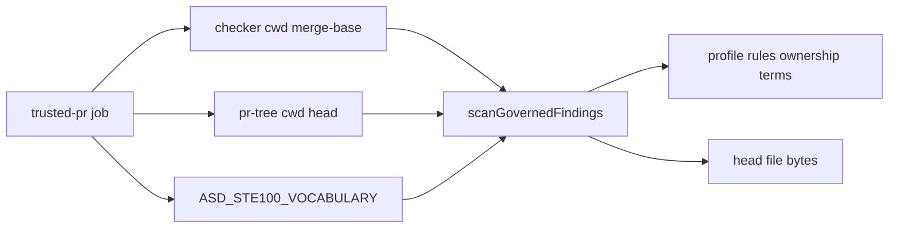
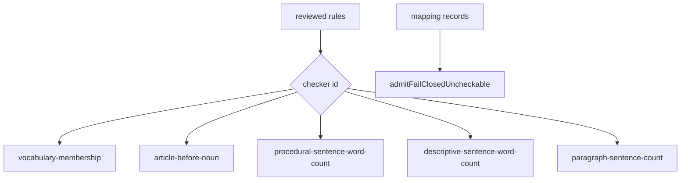

# ASD-STE100 Remediation Wave 1 - Plan

## Goal Capsule

- **Objective:** Close the eleven consensus must and should defects before campaign review of ASD-STE100 enforcement, without amending the parent campaign plan body.
- **Product authority:** Parent campaign `docs/plans/2026-08-13-001-feat-asd-ste100-enforcement-plan.md` remains the product contract. This wave is labeled `asd-ste100-remediation-w1`. Wave unit ids `U1`–`U11` are local to this plan and pair with `RM1`–`RM11`. They are not parent `U10`–`U14`.
- **Open blockers:** HEAD currently names a missing `scripts/asd-ste100` tree object. Official vocabulary remains unprovisioned on Forgejo. Distinct live reviewer principals for mapping records are not yet operator-supplied.
- **Stop:** Do not start work-registry or CAN. Do not copy Issue 9 dictionary or examples into git. Do not edit the parent campaign plan body.

---

## Product Contract

### Summary

Wave 1 makes the live suite honest: reachable git objects, fail-closed vocabulary, checker vs PR-head split, fixture classification, live checker dispatch, mapping provenance, 5.1 kind, leak scan, principal review, and trusted-runner wiring.

Product Contract preservation: unchanged from the parent campaign. This wave adds only remediation requirements `RM-R1`–`RM-R11`.

### Problem Frame

Adversarial review of parent units U10–U14 found defects that make campaign review unsafe. The clone cannot even show HEAD files under `scripts/asd-ste100`. Connected scans can look green when vocabulary is missing. Profile and file bytes share one cwd. Privileged globs swallow fixtures. Live `reviewed: true` has no mapping rows.

### Actors

Actors A1–A7 are unchanged from the parent campaign.

### Requirements

Parent R10–R14, R38–R43, R46–R49, R54 remain in force.

- RM-R1. Every blob under `scripts/asd-ste100` at HEAD must be reachable. `git show HEAD:scripts/asd-ste100/cli.ts` must succeed.
- RM-R2. Vocabulary-gate errors must fail the connected CLI. They must not become `findings: []`.
- RM-R3. Profile, ownership, and terms must load from the checker (merge-base) tree. File bytes for language checks must come from PR-head (or corpus HEAD).
- RM-R4. Fixture and external-evidence globs must classify before privileged globs. Privileged must not include all of `scripts/asd-ste100/**` if that hides fixtures.
- RM-R5. Live scan must run only checkers named on reviewed `rules[].checker`, plus named fail-closed admission for `fail_closed_uncheckable` rows. Dead registry dispatch is not allowed.
- RM-R6. A live `reviewed: true` rule must have a mapping record. Empty `mapping/records/` with live reviewed ASD ids is not allowed.
- RM-R7. Live mappings must keep KTD28 provenance: author id, reviewer id, source pages. Merge of unreviewed agent chunks may still blank review flags. Promote and live profile must not drop provenance.
- RM-R8. Rule 5.1 procedural kind requires a list item and an imperative. A list prefix alone is not enough. Imperative sentences such as those starting with Then plus a verb must still classify as procedural when they instruct.
- RM-R9. Vocabulary leak scan must match tokens or structured extracts, not the entire official file as one needle. An empty or failed git diff used as a leak workspace must fail closed.
- RM-R10. Review validation must require distinct principals, not only distinct user ids. Attestation `ownershipSha256` must hash the ownership manifest, not copy `vocabularySha256`. Author, reviewer, and override arrays must reflect the run.
- RM-R11. Trusted Forgejo jobs must mount `ASD_STE100_VOCABULARY` when the job is connected, map required secrets into `env`, and fetch both PR base and PR head.

### Key Flows

- F1. Operator or agent restores object reachability, then implements U2–U11 against a reachable tree.
- F2. Connected PR scan: checker cwd supplies profile; `ASD_STE100_PR_TREE` supplies head bytes.
- F3. Mapping promote copies provenance onto live rules only after a distinct principal reviews.

### Acceptance Examples

- AE-RM1. `git cat-file -t` on the `scripts/asd-ste100` tree named by HEAD succeeds. `git show HEAD:scripts/asd-ste100/cli.ts` prints the file.
- AE-RM2. Connected mode with a missing vocabulary file exits non-zero and does not report an empty finding list as success.
- AE-RM3. PR-head changes to `t2.asd-ste100.rules.json` do not change which checkers the merge-base checker process runs.
- AE-RM4. A path under `scripts/asd-ste100/test/fixtures/` classifies as fixture, not privileged.
- AE-RM5. A reviewed profile rule with `checker: article-before-noun` is the only 4.5 path that runs. A `fail_closed_uncheckable` mapping row without a valid override produces `T2-ADMISSION-uncheckable`.
- AE-RM6. Loading a live profile that lists `reviewed: true` for 1.1 with no matching mapping record fails validation.
- AE-RM7. After promote, the live rule object still has `reviewerId` and `sourcePages`.
- AE-RM8. `- The runner is long.` stays descriptive. `- Install the runner.` is procedural. `Then install the runner.` is procedural.
- AE-RM9. Official bytes that contain many words fail a workspace that includes one official lemma token. A swallowed empty git diff fails the wave leak gate.
- AE-RM10. Two user ids on one principal cannot approve a review. Attestation ownership digest changes when ownership.json changes and vocabulary bytes do not.
- AE-RM11. Trusted-pr YAML maps `GITHUB_TOKEN` and mounts vocabulary for connected mode. The job fetches base.sha and head.sha.

---

## Planning Contract

### Assumptions

- Parent Product Contract is unchanged. R44 and R45 still keep work-registry and CAN out of this campaign.
- Coverage-only mapping rows in this wave may use `sourcePages: []` and `coverageKind: live-pin`. They must set `issue9PagesMapped: false`. They must not invent Issue 9 page numbers from memory.
- Tests may use two fixture principals. Live git records must not claim official page review.
- Object restore may rebuild the missing tree from the working copy if the pack object cannot be recovered. That may create a new commit. It must not rewrite published history unless the operator asks.
- Forgejo secret names for the vocabulary file stay operator-owned. The workflow must declare the env mapping even if the secret is still empty.

### Key Technical Decisions

- KTD-RM1. Isolate this wave. New plan, JSON index, JSON schema, and internals note. Do not edit `docs/plans/2026-08-13-001-feat-asd-ste100-enforcement-plan.md`.
- KTD-RM2. Split scan roots. `checkerCwd` (process cwd / merge-base checkout) loads `t2.asd-ste100.json`, ownership, terms, and checker code. `treeCwd` (`ASD_STE100_PR_TREE` or same as checker for corpus) is used only for `git show` of governed file bytes and changed-path lists.
- KTD-RM3. Classify in this order: raw, external-evidence, fixture, machine, privileged, owned. Narrow `privilegedGlobs` so they do not include `scripts/asd-ste100/test/**`.
- KTD-RM4. `scanGovernedFindings` dispatches `ENFORCED_CHECKERS[rule.checker]` for each reviewed profile rule. It does not always call the full mechanical bundle. `admitFailClosedUncheckable` runs for mapping rows with class `fail_closed_uncheckable`.
- KTD-RM5. Live-pin mapping records are coverage-only until official U12 waves exist. `reviewed: true` on the profile still requires a mapping row with a distinct `reviewerId`.
- KTD-RM6. Leak scan tokenizes official UTF-8 into lemmas of minimum length and rejects workspace text that contains those tokens. Whole-file `includes` is not sufficient. `readGitDiff` must throw on git failure or empty required diff when `gitCwd` is set.
- KTD-RM7. `validateReview` resolves author and reviewer principals from the roster and fails when they are equal. Attestation hashes ownership bytes separately from vocabulary bytes.

### High-Level Technical Design

Checker versus PR-head:

Live dispatch:

Unit order: U1 first. U7 before U6. U2 and U3 before U5 and U11. U4, U8, U9, U10 may proceed after U1 in parallel.

### Scope Boundaries

In scope: RM-R1–RM-R11 and the eleven units below.

Deferred to follow-up: official 430-page mapping waves, live Forgejo vocabulary proofs, parent-campaign U12 remaining operator waves.

Outside this product: work-registry implementation, CAN campaign, ASD certification claims, copying Issue 9 text into git.

---

## Implementation Units

### U1. Restore reachable scripts/asd-ste100 tree at HEAD

**Goal:** Make HEAD a shippable object. Campaign review must be able to `git show` suite files.

**Requirements:** RM-R1.

**Dependencies:** none.

**Files:**

- Modify: `.git` object store only as needed to restore reachability
- Test: none as a product test; prove with git object commands

**Approach:** Confirm the tree named by `HEAD:scripts/asd-ste100` (`69a52ecf389a7e9174707e6732cf33ae4f17eeed` at the last broken HEAD). Recover the object from pack, another clone, or by writing a new tree from the working copy. Remove leftover `tmp_*` pack files only if they are not the sole remaining copy of objects. Do not force-push. Do not amend published history.

**Execution note:** This is object-store repair. Prefer reachability proof over unit tests.

**Test scenarios:**

- Test expectation: none -- object-store repair.

**Verification:** `git cat-file -t` on the named tree succeeds. `git show HEAD:scripts/asd-ste100/cli.ts` succeeds. A connectivity walk from HEAD reports no missing objects under that path.

### U2. Fail closed on vocabulary-gate errors

**Goal:** Missing or mismatched official bytes must fail connected mode before language checks look green.

**Requirements:** RM-R2, parent R10–R12, AE-RM2.

**Dependencies:** U1.

**Files:**

- Modify: `scripts/asd-ste100/cli.ts`
- Test: `scripts/asd-ste100/cli.test.ts`

**Approach:** Stop catching `isVocabularyGateError` in `createDefaultDeps` and converting it to empty findings. Re-throw. Connected scans with `officialBytes === null` must fail before 1.1 runs on an empty allow-list. Fixture mode stays able to run without official bytes.

**Test scenarios:**

- Covers AE-RM2. Connected `--mode pr` with unset `ASD_STE100_VOCABULARY` exits non-zero.
- Checksum mismatch still throws before findings are treated as success.
- Fixture mode still passes without official bytes.

**Verification:** Focused cli tests fail closed for connected missing vocabulary and still pass fixture mode.

### U3. Load profile from checker; scan file bytes from PR head

**Goal:** A PR cannot rewrite the rule set the merge-base checker enforces by editing profile JSON on the head tree.

**Requirements:** RM-R3, AE-RM3, parent R54.

**Dependencies:** U1.

**Files:**

- Modify: `scripts/asd-ste100/cli.ts`
- Test: `scripts/asd-ste100/cli.test.ts`, `scripts/asd-ste100/scan.test.ts`

**Approach:** Add an explicit checker cwd versus tree cwd. `createDefaultDeps` keeps process cwd as checker root. `ASD_STE100_PR_TREE` is tree cwd only. `scanGovernedFindings` loads ownership, profile, and terms from checker cwd. `git show` of governed paths uses tree cwd and head SHA. Merge-base git commands run in checker cwd.

**Test scenarios:**

- Covers AE-RM3. Head tree profile adds a fake checker id; the scan still uses checker-cwd rules.
- Corpus mode with no `ASD_STE100_PR_TREE` uses one cwd for both.
- Head file bytes still produce findings for governed prose on the PR tree.

**Verification:** Scan tests show split roots. Profile mutation on the data tree does not change loaded rules.

### U4. Classify fixtures and evidence before privileged globs

**Goal:** Fixture and evidence paths stay out of STE findings even when they sit under `scripts/asd-ste100`.

**Requirements:** RM-R4, AE-RM4, parent R3, R6.

**Dependencies:** U1.

**Files:**

- Modify: `scripts/asd-ste100/ownership.ts`
- Modify: `t2.asd-ste100.ownership.json`
- Test: `scripts/asd-ste100/ownership.test.ts`
- Modify: `docs/internals/asd-ste100-remediation-w1.md` owned-glob note if ownership lists grow

**Approach:** Reorder `classifyPath` so raw, external-evidence, fixture, and machine match before privileged. Narrow `privilegedGlobs` to control files (profile JSON, workflow, non-test script entrypoints) rather than `scripts/asd-ste100/**`. Add this wave’s docs to `ownedGlobs` so they are T2-authored text, not unclassified. Do not mark remediation docs privileged.

**Test scenarios:**

- Covers AE-RM4. `scripts/asd-ste100/test/fixtures/raw/x.txt` is raw.
- `scripts/asd-ste100/test/fixtures/evidence/x.log` is external-evidence.
- `scripts/asd-ste100/cli.ts` remains privileged or owned as designed for control files.
- `docs/plans/2026-08-14-001-fix-asd-ste100-remediation-wave-1-plan.md` is owned, not unclassified.

**Verification:** Ownership tests encode the new order. Fixture scans do not depend on `skipScanPath` `/test/` as the only escape.

### U5. Dispatch live scan from rules[].checker and admit uncheckable rows

**Goal:** The registry is the live scan, not a shadow. Uncheckable mapped rules fail admission by name.

**Requirements:** RM-R5, AE-RM5, parent R14, R43.

**Dependencies:** U1, U2, U3.

**Files:**

- Modify: `scripts/asd-ste100/cli.ts`
- Modify: `scripts/asd-ste100/registry.ts`
- Modify: `scripts/asd-ste100/admission.ts`
- Test: `scripts/asd-ste100/cli.test.ts`, `scripts/asd-ste100/registry.test.ts`, `scripts/asd-ste100/admission.test.ts`, `scripts/asd-ste100/scan.test.ts`

**Approach:** `scanGovernedFindings` loads the checker-cwd profile, validates reviewed rules, and for each extracted span calls the checker named on each rule. Remove the always-on `checkMechanicalRules` plus `checkMembershipAndIdentification` pair that ignores `rules[]`. Keep T2 heuristic claim checks only if the parent still requires them as non-ASD ids. For each mapping record with class `fail_closed_uncheckable`, call `admitFailClosedUncheckable`. Unknown checker ids fail closed.

**Test scenarios:**

- Covers AE-RM5. Profile with only 4.5 does not emit 5.1 findings.
- Unknown `rules[].checker` fails before findings.
- A `fail_closed_uncheckable` row without override emits `T2-ADMISSION-uncheckable`.
- A valid distinct-principal override admits that row.

**Verification:** Registry and scan tests prove dispatch matches `rules[]`. Admission helper is no longer test-only.

### U6. Require mapping records for live reviewed rules

**Goal:** Live `reviewed: true` cannot exist without a mapping row.

**Requirements:** RM-R6, AE-RM6, parent KTD28, KTD31.

**Dependencies:** U1, U7.

**Files:**

- Modify: `scripts/asd-ste100/mapping/promote.ts`
- Modify: `scripts/asd-ste100/vocabulary.ts`
- Create: `scripts/asd-ste100/mapping/records/` coverage-only live-pin JSON (no official wording)
- Modify: `t2.asd-ste100.rules.json` only if provenance fields require it
- Test: `scripts/asd-ste100/mapping/promote.test.ts`, `scripts/asd-ste100/vocabulary.test.ts`

**Approach:** Profile validation fails when a reviewed ASD rule has no mapping record. Land coverage-only records for each live ASD id with `coverageKind: live-pin` and `issue9PagesMapped: false`. Do not invent page numbers. Do not quote Issue 9. Distinct fixture author and reviewer ids satisfy the record shape. Official page mapping stays parent U12.

**Test scenarios:**

- Covers AE-RM6. Reviewed 1.1 with empty records fails.
- A live-pin record with distinct reviewer attaches.
- Records contain no official dictionary tokens under leak scan.

**Verification:** Promote and profile tests fail closed on missing records. `mapping/records/` is more than `.gitkeep`. Leak scan of records is clean.

### U7. Persist KTD28 provenance on live mappings

**Goal:** Reviewer id and source pages survive merge-to-profile.

**Requirements:** RM-R7, AE-RM7, parent KTD28.

**Dependencies:** U1.

**Files:**

- Modify: `scripts/asd-ste100/vocabulary.ts` (`AsdRuleMapping`)
- Modify: `scripts/asd-ste100/mapping/merge.ts`
- Modify: `scripts/asd-ste100/mapping/promote.ts`
- Test: `scripts/asd-ste100/mapping/merge.test.ts`, `scripts/asd-ste100/mapping/promote.test.ts`

**Approach:** Extend `AsdRuleMapping` with `authorId`, `reviewerId`, and `sourcePages`. `emptyReview` still blanks review on inbound unreviewed agent chunks. `markMappingReviewed` and `mappingRowToLiveRule` copy provenance onto the live rule. Merge of two reviewed rows with disagreeing reviewer ids fails.

**Test scenarios:**

- Covers AE-RM7. Promoted rule keeps `reviewerId` and `sourcePages`.
- Unreviewed chunk merge still results in `reviewed: false`.
- Live rule JSON round-trip preserves provenance fields.

**Verification:** Promote tests assert provenance on the live object. Merge tests still reject self-review.

### U8. Narrow rule 5.1 kind to list item and imperative

**Goal:** Procedural word-count fires on instructions, not on every dashed sentence.

**Requirements:** RM-R8, AE-RM8, parent mechanical 5.1.

**Dependencies:** U1.

**Files:**

- Modify: `scripts/asd-ste100/rules.ts`
- Test: `scripts/asd-ste100/rules.test.ts`
- Modify: any docs test that hardcodes `kind: "descriptive"` only if the new classifier disagrees with a required fixture

**Approach:** `inferMechanicalKind` returns procedural when the text is a list item and the remainder is imperative, or when the sentence is imperative (including Then plus an instruction verb). List prefix plus a descriptive clause stays descriptive. Keep the verb set conservative; add Then-prefix handling rather than a huge allow-list unless tests demand a specific verb.

**Test scenarios:**

- Covers AE-RM8. Dashed descriptive clause is descriptive.
- Dashed install instruction is procedural.
- `Then install the runner.` is procedural.
- A 22-word dashed description does not emit 5.1.

**Verification:** `inferMechanicalKind` tests cover list-only, list-plus-imperative, Then-imperative, and descriptive.

### U9. Per-token leak scan and fail-closed empty git diff

**Goal:** Leak detection catches a single official lemma. A failed git diff cannot skip the scan.

**Requirements:** RM-R9, AE-RM9, parent R43.

**Dependencies:** U1.

**Files:**

- Modify: `scripts/asd-ste100/attestation.ts`
- Modify: `scripts/asd-ste100/mapping/wave.ts`
- Test: `scripts/asd-ste100/attestation.test.ts`, `scripts/asd-ste100/mapping/wave.test.ts`, `scripts/asd-ste100/admission-boundaries.test.ts`

**Approach:** Tokenize official UTF-8 into lemmas above a minimum length. Scan workspace strings for those tokens. Do not use the entire official file as one `includes` needle. `readGitDiff` must not convert git failure into `""` when a leak workspace is required. Empty diff when the wave expected a git cwd fails closed.

**Test scenarios:**

- Covers AE-RM9. Workspace containing one official lemma fails.
- Workspace equal to the whole official file still fails.
- Official bytes null still returns unavailable / fail closed.
- Git diff command failure fails the wave.

**Verification:** Attestation and wave tests cover token leak and empty-diff failure. No official Issue 9 words are committed as fixtures; use synthetic lemmas.

### U10. Compare principals and fill attestation fields

**Goal:** Same-principal two-user review fails. Attestation ownership and actor lists are real.

**Requirements:** RM-R10, AE-RM10, parent R49, KTD22.

**Dependencies:** U1.

**Files:**

- Modify: `scripts/asd-ste100/override.ts`
- Modify: `scripts/asd-ste100/cli.ts`
- Modify: `scripts/asd-ste100/attestation.ts`
- Test: `scripts/asd-ste100/override.test.ts`, `scripts/asd-ste100/attestation.test.ts`

**Approach:** `validateReview` looks up the pull author principal and the reviewer principal. Equal principals fail even when user ids differ. Sub-agent ids share the parent principal as in the parent campaign. `buildAttestation` takes ownership digest from ownership manifest bytes, corpus digest from the governed path set, and copies author and reviewer ids from the run. Do not assign `ownershipSha256 = vocabularySha256`.

**Test scenarios:**

- Covers AE-RM10. Two user ids, one principal, review fails.
- Distinct principals pass when other review rules pass.
- Attestation ownership digest changes only when ownership bytes change.
- `authorIds` / `reviewerIds` / `overrides` are not hard-coded empty when the run has values.

**Verification:** Override tests cover principal equality. Attestation tests cover distinct hashes.

### U11. Mount vocabulary, map secrets, fetch PR base and head

**Goal:** Trusted jobs can run connected mode with both trees and declared secrets.

**Requirements:** RM-R11, AE-RM11, parent R54.

**Dependencies:** U1, U2, U3.

**Files:**

- Modify: `.forgejo/workflows/asd-ste100.yml`
- Modify: `docs/operations/asd-ste100-forgejo.md`
- Test: workflow structure tests if present; otherwise parse-level assertions in an existing asd-ste100 test, or a small workflow fixture test under `scripts/asd-ste100/`

**Approach:** Map `GITHUB_TOKEN` and `PACKAGE_TOKEN` through `secrets` into `env` where the steps already interpolate them. Set `ASD_STE100_VOCABULARY` on trusted-pr, trusted-main, and trusted-release from the operator secret or documented mount path. Keep fetching base.sha into checker and head.sha into pr-tree. Advisory job stays fixture-only and must not receive vocabulary. Do not claim live Forgejo green in this unit; wiring is the deliverable.

**Test scenarios:**

- Covers AE-RM11. Workflow YAML for trusted-pr contains `ASD_STE100_VOCABULARY` and both fetch SHAs.
- Advisory job does not set connected vocabulary.
- Token interpolation is backed by an `env` mapping, not a bare unset `${GITHUB_TOKEN}` with no secrets block.

**Verification:** Workflow file review plus a focused test that the YAML contains the required env keys. No live runner proof required for this wave.

---

## Verification Contract

| Gate | Command or evidence | Applies |
| --- | --- | --- |
| HEAD reachability | `git show HEAD:scripts/asd-ste100/cli.ts` succeeds | U1 |
| Focused unit tests | `vp test run` on touched `scripts/asd-ste100/*.test.ts` | U2–U10 |
| Scripts typecheck | `vp run --filter @t3tools/scripts typecheck` | U2–U10 |
| Leak scan of mapping records | No official tokens in `scripts/asd-ste100/mapping/records/` | U6, U9 |
| Workflow keys | trusted jobs declare vocabulary env and both SHAs | U11 |
| Parent plan untouched | `git diff` does not include `docs/plans/2026-08-13-001-feat-asd-ste100-enforcement-plan.md` | all |

---

## Definition of Done

- All eleven units U1–U11 (RM1–RM11) meet their verification fields.
- Parent campaign plan body is unmodified.
- Remediation label `asd-ste100-remediation-w1` remains the only new campaign attachment for this wave.
- Claim string is still "ASD-STE100 mechanical rule-subset result".
- Work-registry and CAN files are not added.
- Official Issue 9 dictionary and examples are absent from git.

### Per-unit done

- U1. HEAD tree for `scripts/asd-ste100` is reachable.
- U2. Connected vocabulary errors fail the CLI.
- U3. Checker cwd owns profile; tree cwd owns file bytes.
- U4. Fixtures classify before privileged.
- U5. Live scan follows `rules[].checker` and admission helper.
- U6. Live reviewed rules have mapping records.
- U7. Provenance fields persist on live rules.
- U8. 5.1 kind matches list-and-imperative plus Then-imperative.
- U9. Token leak scan and fail-closed git diff.
- U10. Principal inequality and real attestation hashes.
- U11. Workflow env, vocabulary mount, base and head fetch.

---

## Appendix

### Artifact set

- Plan: `docs/plans/2026-08-14-001-fix-asd-ste100-remediation-wave-1-plan.md`
- Index: `docs/plans/2026-08-14-001-fix-asd-ste100-remediation-wave-1.json`
- Schema: `docs/plans/schemas/asd-ste100-remediation-wave.schema.json`
- Internals: `docs/internals/asd-ste100-remediation-w1.md`

### Pick-list map

| Pick | Severity | Wave id | RM |
| --- | --- | --- | --- |
| 1 Restore missing tree | must | U1 | RM1 |
| 2 Vocab gate swallow | must | U2 | RM2 |
| 3 Checker vs PR-head | must | U3 | RM3 |
| 4 Privileged vs fixture | must | U4 | RM4 |
| 5 Live checker dispatch | must | U5 | RM5 |
| 6 Mapping records | must | U6 | RM6 |
| 7 KTD28 provenance | should | U7 | RM7 |
| 8 Rule 5.1 kind | should | U8 | RM8 |
| 9 Leak scan / git diff | should | U9 | RM9 |
| 10 Principal / attestation | should | U10 | RM10 |
| 11 Workflow secrets | should | U11 | RM11 |
