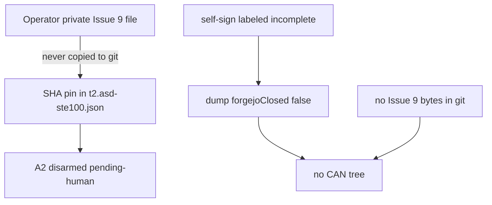

# Human-gate honesty remediation - Plan

## Goal Capsule

- **Objective:** Make A1, A3, W1, W4, and W5 impossible to mistake for closed, and keep A2 disarmed until A1 is a real Issue 9 mount. Machinery stays; labels tell the truth.
- **Product authority:** T2 owns the honesty contract. Do not edit `docs/plans/2026-08-13-001-feat-asd-ste100-enforcement-plan.md`. Do not start CAN. Do not copy Issue 9 rows, examples, or page images into git.
- **Stop:** If a unit would set `vocabularyReview` to `human-verified`, set `forgejoApproved` true, drop `humanOverride` without a Forgejo-review, OCR Issue 9, or add a CAN tree, stop and escalate.

---

## Product Contract

### Summary

The org already chose ASD CI, then the work-registry, then CAN.
The unanimous remediate set is not a missing feature list.
It is a set of false-close risks: fixture pin treated as Issue 9, self-sign treated as mapping review, override treated as Forgejo admission, registry existence treated as license to commit the dictionary, and CAN started early.
A2 stays a gated later step after A1.

### Problem Frame

Live profile pin SHA `f2a23a43dd5d94cbc2d33e4338b9ed529cdd3945ca3ce91fde425455637e22cb` is the synthetic fixture.
`vocabularyReview` is `pending-human`.
Mapping identities `u12-wave-author` and `operator-self-sign` share principal `t2-single-operator`.
Live campaigns `asd-ste100-compliance` and `registry-yaml-write` use `humanOverride: true`.
Dump `approved` is true when override satisfies `campaignIsApproved`.
That reads as closed admission.

### Actors

- A1. **Human operator:** Inspects the private Issue 9 file. Signs A1. Later may sign A2. Supplies a distinct principal for mapping review. Does not edit compiled schema.
- A2. **Authoring agent:** Implements honesty checks, docs, and dump fields. Never flips human-verified or Forgejo-approved.
- A3. **Admission CI:** Fails when a forbidden tree or a lying label appears. Passes fixture mode and override campaigns that stay labeled override.

### Key Flows

- F1. Operator mounts private vocabulary and verifies the pin without flipping review.
- F2. Agent ships dump and docs that distinguish override from Forgejo-closed.
- F3. CI fails closed if Issue 9-shaped rows or a CAN path enter git.
- F4. After F1, a later unit may arm Rule 1.1 and 4.5 on G2. That unit is out of this slice unless the operator has completed A1.

### Requirements

- R1. Git must not gain Issue 9 lemmas, dictionary rows, examples, or page images.
- R2. Provision of the committed fixture must keep `vocabularyReview` as `pending-human`.
- R3. `--verify-only` may confirm pin match and must not flip review.
- R4. Live mapping provenance must remain labeled self-sign / same-principal. `reviewed: true` on live checkers may stay so length and membership checkers keep running. The lie to remove is “distinct-principal review is done.”
- R5. Dump and docs must not treat `humanOverride` as Forgejo-closed.
- R6. Named override campaigns may keep registering. They must stay `forgejoApproved: false`.
- R7. CAN paths stay absent. Sequence ASD CI → work-registry → CAN stays inverted-fail.
- R8. A2 (1.1 and 4.5 fail G2) must not run in this campaign. Document the arming step only.

### Acceptance Examples

- AE1. **Covers R2, R3.** Given the synthetic fixture, when provision or verify-only runs, then review stays `pending-human` even if a temp profile was `human-verified`.
- AE2. **Covers R5, R6.** Given dump of the live tree, when a campaign has override, then the record shows override and does not claim Forgejo-closed.
- AE3. **Covers R4.** Given `principals.json`, when both mapping identities share one principal, then a dedicated honesty test names that self-sign is not KTD28-complete.
- AE4. **Covers R1, R7.** Given the repo tree, when CAN paths or an official-shaped `words` file appear under git, then a local check fails.
- AE5. **Covers R8.** Given this campaign, when tests and live profile are inspected, then `vocabularyReview` is still `pending-human` and G2 still ignores 1.1 and 4.5.

### Success Criteria

- An operator can follow one runbook for A1 without an agent OCR step.
- CI and dump cannot describe override campaigns as Forgejo-approved.
- Self-sign is visible as incomplete mapping review.
- CAN and Issue 9 bytes still cannot enter git through this work.
- A2 remains disarmed.

### Scope Boundaries

**In this slice**

- Operator runbook for private mount and pin check.
- Dump and internals honesty for override vs closed.
- Tests that lock fixture pin, pending-human, shared principal, CAN absence, and no official words file in git.
- Explicit A2 hold.

**Deferred for later**

- Operator completes A1 (inspect real Issue 9 file, update pin off git).
- Operator completes A2 after A1 (set `human-verified`).
- Distinct-principal mapping review and dropping `selfSign`.
- Forgejo-review on live campaigns and dropping `humanOverride` (W2).
- Wiring `createDefaultDeps` to a live Forgejo pull payload (A4 already passed as policy; not this remediate set).

**Outside this product's identity**

- ASD certification claims.
- OCR of Issue 9 JPGs into git.
- Editing the parent ASD campaign plan body.
- Adding `docs/plans/2026-08-13-002-feat-t2-work-registry-plan.md` as a required git path.
- CAN manifold implementation.

### Assumptions

- Canonical Issue 9 scans stay in `/Users/maxholden/T2-SQUARED-References` (operator machine), not in this git tree.
- One human principal exists today. A3 cannot be closed in software until a second principal exists.
- GitHub Actions remain non-authoritative. Local `npm run test:asd-ste100`, `npm run ci:asd-ste100`, `npm run test:work-registry`, and `npm run ci:work-registry` are the gates.

---

## Planning Contract

### Key Technical Decisions

- **KTD1. Checker live is not mapping-reviewed.** Keep live Rule 1.1 / 4.5 / 5.1 / 6.3 / 6.6 checkers. Record `coverageKind` / `selfSign: true` / shared principal as the honesty signal. Do not mass-set `reviewed: false` in this slice.
- **KTD2. Dump closed vs admitted.** Keep `campaignIsApproved` for register (override still admits). Add a dump field such as `forgejoClosed` that is true only when `forgejoApproved && humanApproved && !humanOverride`. Stop using `approved` as if it meant Forgejo-closed.
- **KTD3. Fixture provision cannot close A1.** `installProvisionalVocabulary` continues to force `pending-human`. No new flag writes `human-verified`.
- **KTD4. A2 is a later campaign unit.** This plan documents the arming sequence and forbids implementing the flip.
- **KTD5. W4/W5 are fail-closed tests, not new products.** Extend existing leak / AE10 style checks. Do not build CAN.

### High-Level Technical Design

### Sequencing

U1 docs and operator A1 runbook.
U2 dump honesty (W1).
U3 mapping self-sign honesty tests (A3).
U4 hold tests for A1/A2 pin and pending-human.
U5 hold tests for W4/W5.

U2–U5 have no human gate. U1 is documentation the operator uses later.

---

## Implementation Units

### U1. Operator A1 runbook and internals honesty

**Goal:** Write STE-safe operator steps for private mount and pin verify. State that A2 stays off. State that Issue 9 bytes stay off git.

**Requirements:** R1, R2, R3, R8

**Dependencies:** none

**Files:**

- Modify: `docs/operations/asd-ste100-forgejo.md`
- Modify: `docs/internals/asd-ste100-enforcement.md`
- Modify: `docs/internals/t2-squared-work-registry.md`
- Test: `scripts/asd-ste100/docs.test.ts`
- Test: `scripts/work-registry/docs.test.ts`

**Approach:** Add short sentences: provision mounts the fixture; verify-only checks the pin; a human inspects the private file before any pin change off the fixture; A2 does not flip in this slice; override is not Forgejo-closed. Keep existing required strings (pending-human, dump of the private file, t2-trusted). Do not paste lemmas.

**Test scenarios:**

- Owned ops and internals docs still pass mechanical rules and claim checks.
- Docs mention verify-only or pin check without flipping review.
- Work-registry internals still say live campaigns use override.

**Verification:** `node --experimental-strip-types --test scripts/asd-ste100/docs.test.ts scripts/work-registry/docs.test.ts`

---

### U2. Dump distinguishes admitted override from Forgejo-closed

**Goal:** Dump JSON cannot be read as “Forgejo approved this campaign” when only override is true.

**Requirements:** R5, R6

**Dependencies:** none

**Files:**

- Modify: `scripts/work-registry/registry.ts`
- Modify: `scripts/work-registry/work-registry.test.ts`
- Modify: `scripts/work-registry/cli.test.ts`

**Approach:** Extend `CampaignDump` with `forgejoClosed`. True only if Forgejo approved, human approved, and override is false. Keep `approved` as `campaignIsApproved` so register behavior does not change. Live campaigns must dump `forgejoClosed: false`.

**Test scenarios:**

- Override campaign: `humanOverride` true, `forgejoClosed` false, register still succeeds.
- Forgejo-approved fixture campaign without override: `forgejoClosed` true.
- Dual json+yaml still rejected.
- `npm run ci:work-registry` still passes the live tree.

**Verification:** `npm run test:work-registry` and `npm run ci:work-registry`

---

### U3. Mapping self-sign is incomplete review

**Goal:** Tests and live records keep saying self-sign / shared principal. No second human is invented.

**Requirements:** R4

**Dependencies:** none

**Files:**

- Modify: `scripts/asd-ste100/mapping/promote.test.ts` or a small new `scripts/asd-ste100/mapping/honesty.test.ts`
- Do not rewrite `t2.asd-ste100.rules.json` reviewed flags in this unit.

**Approach:** Assert `principals.json` identities share `t2-single-operator`. Assert live `records.json` `selfSign` is true. Assert `selfSignAllowed` is true while human count is below two. Do not call `markMappingReviewed` with a fake second principal.

**Test scenarios:**

- Shared principal on disk.
- `selfSign: true` on live records.
- Two distinct human principals would make `selfSignAllowed` false (existing test may already cover).

**Verification:** `node --experimental-strip-types --test scripts/asd-ste100/mapping/promote.test.ts` plus any new honesty test file.

---

### U4. A1/A2 hold: fixture pin and pending-human

**Goal:** CI fails if someone flips `human-verified` or retargets the live pin away from the committed fixture without this plan’s later A2 unit.

**Requirements:** R2, R3, R8

**Dependencies:** U1 (docs may already state the hold)

**Files:**

- Modify: `scripts/asd-ste100/registry.test.ts`
- Modify: `scripts/asd-ste100/provision-vocab.test.ts` only if a gap remains

**Approach:** Keep the live profile assertion `vocabularyReview === "pending-human"`. Keep the pin equal to the SHA of `scripts/asd-ste100/test/fixtures/vocab/synthetic.json`. Do not add a writer for `human-verified`.

**Test scenarios:**

- Live profile pending-human.
- Live pin matches synthetic fixture bytes.
- Provision still forces pending-human.
- G2 still ignores 1.1 while pending-human (existing cli test).

**Verification:** `node --experimental-strip-types --test scripts/asd-ste100/registry.test.ts scripts/asd-ste100/provision-vocab.test.ts scripts/asd-ste100/cli.test.ts`

---

### U5. W4/W5 hold: no Issue 9 file in git, no CAN tree

**Goal:** Local checks fail if a CAN implementation path or an official-shaped words document appears in the git tree.

**Requirements:** R1, R7

**Dependencies:** none

**Files:**

- Modify: `scripts/asd-ste100/admission-boundaries.test.ts`
- Optional: `scripts/asd-ste100/attestation.test.ts` only if a new committed-path leak case is needed

**Approach:** Keep AE10 CAN path absence. Add or extend a check that `T2_Squared-Work-Registry/**` and committed vocab paths are not an Issue 9 `words` list (fixture synthetic lemmas only where already allowed). Do not scan operator private directories.

**Test scenarios:**

- CAN paths still absent.
- Committed asd-ste100 fixtures still pass dump-only leak against official needles already used.
- A planted official-shaped words file in a campaign folder would fail the new check (test in tmpdir, not in git).

**Verification:** `node --experimental-strip-types --test scripts/asd-ste100/admission-boundaries.test.ts` and `npm run test:asd-ste100`

---

## Verification Contract

Authoritative local commands only:

- `npm run test:work-registry`
- `npm run ci:work-registry`
- `npm run test:asd-ste100`
- `npm run ci:asd-ste100`

GitHub Actions are non-authoritative.
Do not treat a missing `HEAD` object on this host as a product failure of these units; note it if `ownership.test.ts` live `ls-tree` fails.

---

## Definition of Done

- U1–U5 landed or explicitly blocked.
- Live `vocabularyReview` is still `pending-human`.
- Live campaigns still `forgejoApproved: false` and `humanOverride: true`.
- Dump shows those campaigns as not Forgejo-closed.
- No Issue 9 rows and no CAN tree in git.
- Parent ASD plan body untouched.
- A2 not implemented.

---

## Open Questions

- **Deferred:** When a second human exists, how identities are added to `principals.json` (A3 close).
- **Deferred:** Exact private path on `t2-trusted` for the real Issue 9 file (operator host fact, not git).
- **Blocking for A2 only:** A1 inspection result. Not blocking for U1–U5.

---

## Risks

- Tightening dump `approved` meaning could break a consumer that treated it as Forgejo-closed. Mitigate with a new field instead of silently inverting `approved`.
- Un-reviewing live mapping rows would disable checkers. KTD1 forbids that in this slice.
- Host git object store may still fail `ownership.test.ts` independently of this plan.
