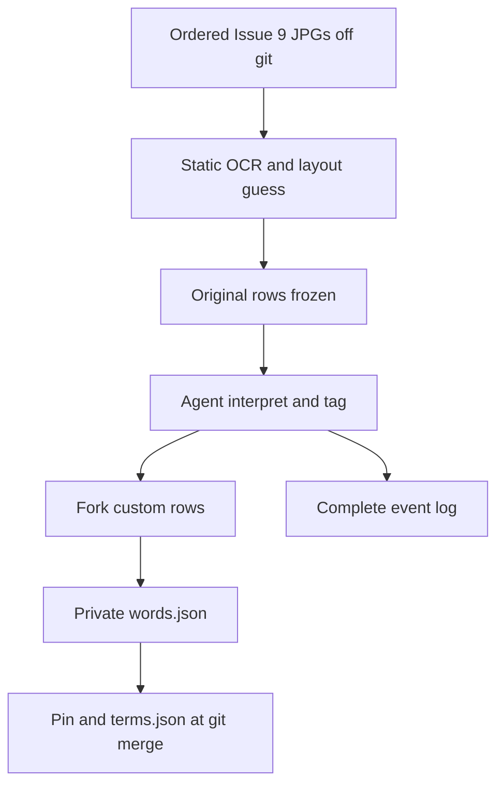

# ASD lexicon bridge - Plan

## Goal Capsule

- **Objective:** Import Issue 9 page scans once into a private ordered entity DB, interpret ASD-STE into T2 surface forms by fork (never overwrite stock), and export a mutated lexicon for Rule 1.1 without copying official rows into git.
- **Product authority:** T2 owns interpreters, filters, tests, pin, and `terms.json` merge at git merge. ASD-STE remains the golden comms standard. Canonical Issue 9 JPGs stay off git.
- **Stop:** If a unit would write official lemmas, dictionary rows, examples, definitions, or page images into git, stop. If a unit would re-OCR the static document after the first import, stop. If a unit would overwrite a stock ASD row in place, stop.

---

## Product Contract

### Summary

ASD words are used and then modified for T2.
The working store is a bridge DB between OCR/ASD originals and T2 internal entities.
Agents and humans share add/moderate rights on that store.
Human authority is any git merge.
Layout guess is automation: static tool plus agent.
Interpreters are a TypeScript plus JSON hybrid.

### Problem Frame

Connected G2 is red because the live pin is a three-lemma test fixture.
A full unmodified Issue 9 dump is the wrong object.
A T2-terms-only lexicon drops ASD building blocks the young codebase still needs.
The missing product is an ordered original import, fork-on-mutate, duplicate collapse by entity reference, and a private export whose SHA is the pin.

### Actors

- A1. **Static layout tool:** OCRs the ordered JPG set once. Guesses header vs item vs typed entity. Writes original rows in scan order.
- A2. **Agent:** Labels, interprets, forks custom terms, tags no-T2-function items, schedules duplicate-reference shuffle, writes events. Same permissions as a human on the working DB.
- A3. **Human:** Same working-DB rights. Enforces authority only when the result git-merges.
- A4. **Admission CI:** Fails if official-shaped `words` or JPGs enter git. Passes synthetic-lemma tests.

### Key Flows

- F1. Scan once. Insert original rows in page/item order. Freeze that layer.
- F2. Tool plus agent guess layout and type (word, principal, workflow, header, item).
- F3. Where T2 does not match ASD, create an interpreter (TS logic + JSON record) and fork a unique custom row. Stock row stays.
- F4. A second modification forks another unique row. No in-place overwrite.
- F5. Duplicates stay until a tested reference-shuffle retargets pointers to the saved entity and removes the duplicate. Open-loop errors emit events; later jobs correct them.
- F6. Agent tags items that cannot transfer to a T2 function (the bar-stock class). Those stay out of the live export.
- F7. Git merge merges accepted surface forms into `t2.asd-ste100.terms.json`, updates `vocabularySha256` / `lemmaCount`, and does not copy original OCR strings.

### Requirements

- R1. Git must not gain Issue 9 lemmas, dictionary rows, examples, definitions, or page images.
- R2. Import is once. The document is static. Re-OCR is out of this product.
- R3. Each header or item is one row. Words, principals, workflows, and other ASD entities are rows.
- R4. Interpreters are TypeScript plus JSON. TS holds deterministic behavior. JSON holds instance records (ids, links, rule ids, hashes). Official strings live only in the private DB.
- R5. Mutate forks. Stock ASD is never overwritten. A later mutate of a custom term is a new unique item.
- R6. Duplicate originals are kept until entity references shuffle to the saved word and the duplicate is removed.
- R7. The event log is complete for an event log: no dropped identity or time. Minimum fields: event id, UTC time, actor id, action, subject entity ids, rule or interpreter id, payload hash, error if any. Extra fields the log requires are kept, not stripped.
- R8. Layout is guessed by static tool plus agent together (automation), not by one or the other alone.
- R9. No-T2-function is an agent judgment at interpret time (items that cannot transfer to T2 function). It is not a committed manufacturing word list.
- R10. Agents and humans share working-DB add/moderate rights. Canonical merge is any git merge.
- R11. Keep unused ASD building blocks except no-T2-function tags. Export leftover originals plus mutated surface forms.
- R12. Live Rule 1.1 uses the private mutated export. `terms.json` merges at git merge.
- R13. Synthetic fixtures in git use only test lemmas such as `qzvstelemmaone`. Real JPG input paths stay operator-local.

### Acceptance Examples

- AE1. **Covers R2, R3, R8.** Given ordered synthetic JPGs with known fake headers and items, when import runs, then row order matches scan order and types are filled by tool guess plus agent correction hooks.
- AE2. **Covers R5.** Given stock row S, when a mutate interpreter runs twice, then S remains and two unique custom rows exist, each linking back to its parent.
- AE3. **Covers R6.** Given two original rows with the same normalized duplicate key, when shuffle runs, then references point at the saved entity and the duplicate row is gone.
- AE4. **Covers R1, R13.** Given the git tree, when a `words` array of official shape or a JPG under the repo appears, then CI fails. Synthetic test lemmas in fixtures may exist.
- AE5. **Covers R7.** Given a failed shuffle, when the event is read, then id, UTC time, actor, subject ids, and error are present.
- AE6. **Covers R9, R11.** Given an agent tag no-T2-function on a synthetic item, when export runs, then that item is absent from `words.json` and an untagged leftover remains.
- AE7. **Covers R10, R12.** Working DB writes do not require `human-verified`. Git merge of pin and `terms.json` is the human gate.

### Success Criteria

- Operators can point the importer at the local ordered JPG set without those bytes entering git.
- Replay of filters on a frozen original layer is deterministic for the same interpreter JSON plus TS.
- Connected G3 can pin the private export SHA. Git stores SHA and count only.
- Duplicate collapse is tested without quoting Issue 9.

### Scope Boundaries

**In this slice**

- Private SQLite (or equivalent) schema off git, path documented, not committed with rows.
- TS importers, layout guess, fork mutate, reference shuffle, event append, export to private `words.json`.
- JSON interpreter instance schema and synthetic fixtures.
- Tests and STE-safe internals note. Pin/export wiring. `terms.json` merge helper used only when git-merging.

**Deferred**

- Distinct-principal KTD28.
- Release identity.
- CAN.
- Re-OCR or living document versions of Issue 9.

**Outside this product**

- ASD certification claims.
- Copying the JPG set or OCR text into the T2-SQUARED git tree.
- Editing `docs/plans/2026-08-13-001-feat-asd-ste100-enforcement-plan.md`.

### Assumptions

- Ordered JPGs exist on the operator machine and VM Downloads trees. Scans stay out of git.
- One static Issue 9 set. Scan once.
- GitHub Actions stay non-authoritative. Local `npm run test:asd-ste100` / `npm run ci:asd-ste100` remain gates.

---

## Planning Contract

### Key Technical Decisions

- **KTD1. Frozen original layer.** Import writes originals once. Filters never rewrite original text.
- **KTD2. Fork-on-mutate.** Custom terms are new rows with parent id. Stock survives.
- **KTD3. Interpreter hybrid.** `scripts/asd-ste100/lexicon/` TypeScript modules plus JSON instance records. Instances in the private DB; git holds schema and synthetic instances only.
- **KTD4. Layout automation.** Static OCR/layout guess plus agent correction is one pipeline, not two products.
- **KTD5. Complete events.** Event rows keep every field the action needs. Do not drop time, id, actor, subjects, or error.
- **KTD6. No-T2-function tag.** Agent-applied. Export omits tagged rows. No official lemma list in git to implement that tag.
- **KTD7. Git merge is canonical.** Pin, `lemmaCount`, and `terms.json` merge happen on git merge. Working DB is agent-native.
- **KTD8. Duplicate pathway.** Keep duplicates; shuffle entity references; then delete the duplicate. Open loop plus events for errors.

### High-Level Technical Design

### Sequencing

U1 schema, events, synthetic original import.
U2 layout guess plus agent hook.
U3 fork interpreter TS/JSON.
U4 duplicate reference shuffle plus events.
U5 export, pin, terms merge, git leak hold.
U6 operator command against real JPG path (writes private DB only).

---

## Implementation Units

### U1. Bridge schema and scan-once import

**Goal:** Private DB with original rows in scan order and a complete event append API.

**Requirements:** R2, R3, R7

**Files:** `scripts/asd-ste100/lexicon/schema.ts`, `scripts/asd-ste100/lexicon/import.ts`, `scripts/asd-ste100/lexicon/events.ts`, `scripts/asd-ste100/lexicon/import.test.ts`

**Approach:** SQLite file path default under operator private dest or tmpdir in tests. Tables: entities, links, events. Tests use synthetic strings only.

**Tests:** Import three synthetic items; ordinal 0,1,2; event has id and UTC time; second import of the same set fails closed (scan once).

**Done:** Scan-once and event completeness tests pass.

---

### U2. Layout guess automation

**Goal:** Static tool assigns a guessed kind; agent hook can correct it. Both required in the pipeline.

**Requirements:** R8

**Files:** `scripts/asd-ste100/lexicon/layout.ts`, `scripts/asd-ste100/lexicon/layout.test.ts`

**Approach:** Heuristic on synthetic page fixtures (not Issue 9 JPGs in git). Agent correction is a function input in tests. Production wires OCR in U6 without committing images.

**Tests:** Header-like synthetic line guessed as header; agent override to workflow persists; both steps recorded in events.

**Done:** Guess plus agent correction is one automated path.

---

### U3. Fork interpreter (TS plus JSON)

**Goal:** Stock row unchanged; custom unique children.

**Requirements:** R4, R5, R11

**Files:** `scripts/asd-ste100/lexicon/interpret.ts`, `scripts/asd-ste100/lexicon/interpret.test.ts`, synthetic JSON under `scripts/asd-ste100/test/fixtures/lexicon/`

**Approach:** TS applies deterministic mutate kinds (product-class to T2 surface tokens such as `t2` / `canBus` as outputs). JSON instance names parent id, child id, interpreter id. Official from-forms stay in the private DB only.

**Tests:** Two mutates yield two children and one intact parent; git fixture JSON has no Issue 9 lemmas.

**Done:** Fork semantics locked.

---

### U4. Duplicate entity-reference shuffle

**Goal:** Tested pathway to retarget any entity pointer to the saved row and drop the duplicate.

**Requirements:** R6, R7

**Files:** `scripts/asd-ste100/lexicon/refs.ts`, `scripts/asd-ste100/lexicon/refs.test.ts`

**Approach:** References are pragmatic: any entity id. Shuffle is schedulable. Failures append full events for a later job.

**Tests:** Two synthetic duplicates; after shuffle one remains; a pointer from a third entity follows the saved id; a forced error still writes id, time, subjects.

**Done:** Open-loop duplicate collapse is tested.

---

### U5. Export, pin, terms merge, leak hold

**Goal:** Private `words.json` from leftover originals plus mutated surfaces, minus no-T2-function. Git pin and merge into `terms.json` only as a merge-time helper. CI still fails official-shaped words in git.

**Requirements:** R1, R9, R10, R12, R13

**Files:** `scripts/asd-ste100/lexicon/export.ts`, `scripts/asd-ste100/lexicon/export.test.ts`, `docs/internals/asd-ste100-enforcement.md`, existing admission-boundaries leak tests extended

**Approach:** Export writes operator dest, never repo campaign trees. Helper updates profile SHA and merges reviewed T2 terms at explicit git-merge invocation.

**Tests:** Tagged synthetic omitted; untagged leftover exported; SHA stable; planting `{words:[...]}` under git still fails.

**Done:** Pin path exists without official bytes in git.

---

### U6. Operator real-scan command

**Goal:** Point at the local ordered JPG directory. Write private DB only.

**Requirements:** R2, R8, R13

**Files:** `scripts/asd-ste100/lexicon/cli.ts`, STE-safe sentences in `docs/internals/asd-ste100-enforcement.md`

**Approach:** CLI `--src` JPG dir `--dest` private DB. Refuses dest inside the git work tree. Does not flip review until a git merge of the pin.

**Tests:** Dest under a fake git root is rejected; dest under tmpdir is accepted with synthetic images generated in the test, not Issue 9 files.

**Done:** Real JPG path is an operator flag, not a repo blob.

---

## Verification Contract

- `npm run test:asd-ste100` includes `scripts/asd-ste100/lexicon/*.test.ts`.
- `npm run ci:asd-ste100` fixture mode still passes without official bytes.
- Leak / AE10 holds remain.
- No Issue 9 JPG or OCR transcript in git.

---

## Definition of Done

- U1–U5 green on synthetic data.
- U6 refuses git dest and does not add scans to git.
- Stock rows cannot be overwritten.
- Events always carry id and UTC time.
- Parent ASD enforcement plan body is untouched.

---

## Open Questions

None blocking.

---

## Risks

- OCR layout guess will mis-type rows. Mitigation: agent correction in the same pipeline; originals frozen so types can be fixed without re-scan.
- Interpreter JSON in git accidentally includes official from-forms. Mitigation: leak scan; git fixtures synthetic-only.
- Export too large for Rule 1.1 performance. Mitigation: measure after first private export; do not drop building blocks in this slice except no-T2-function tags.
